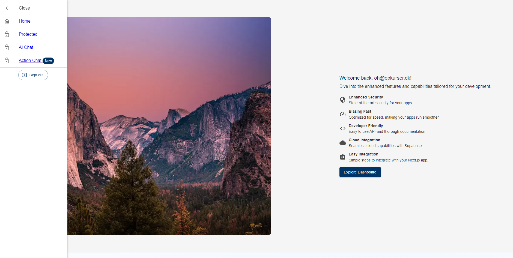
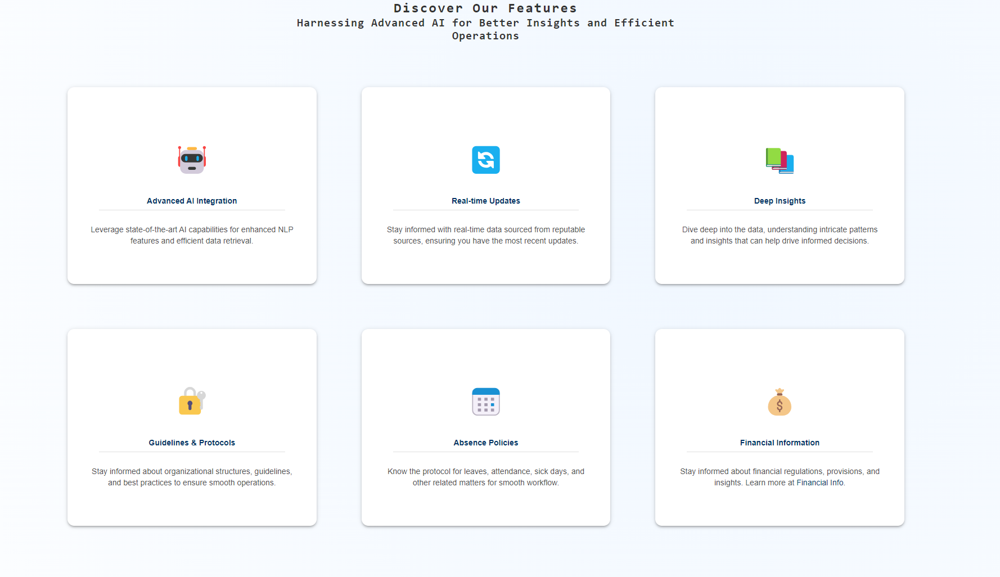
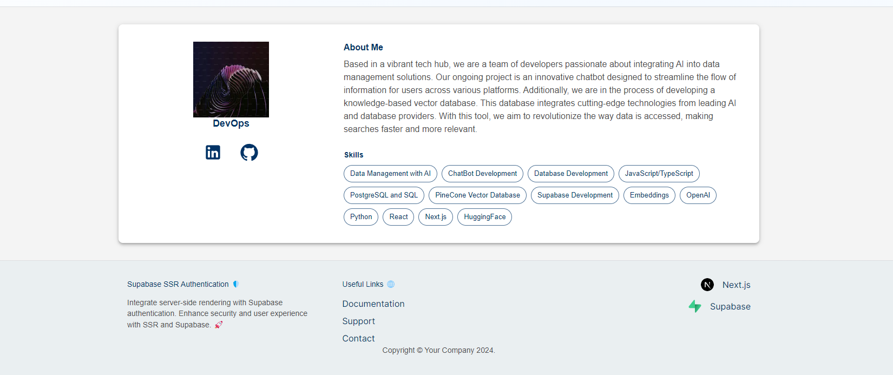
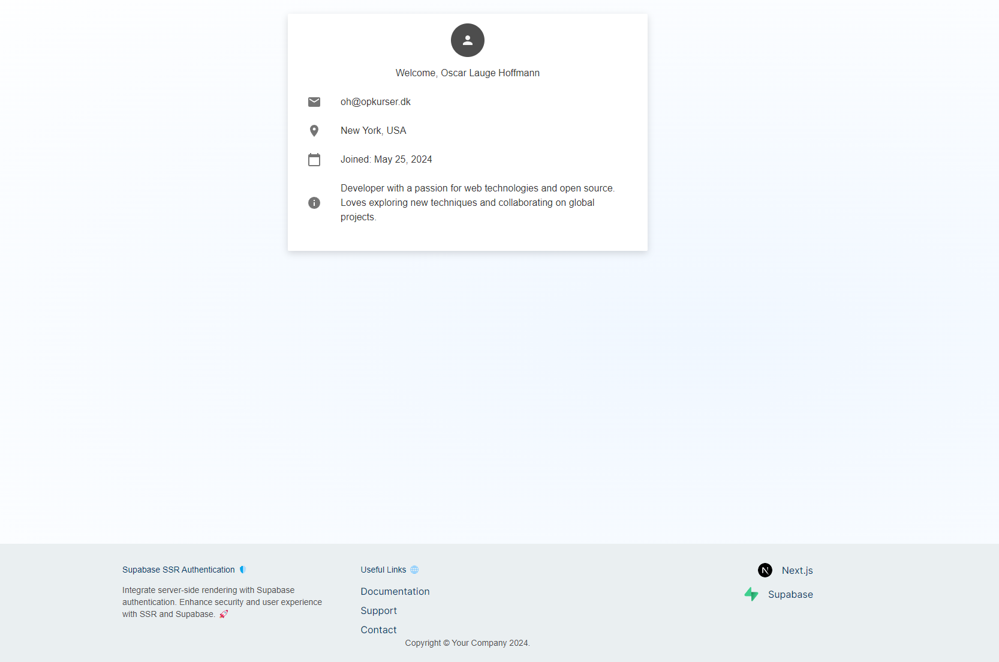
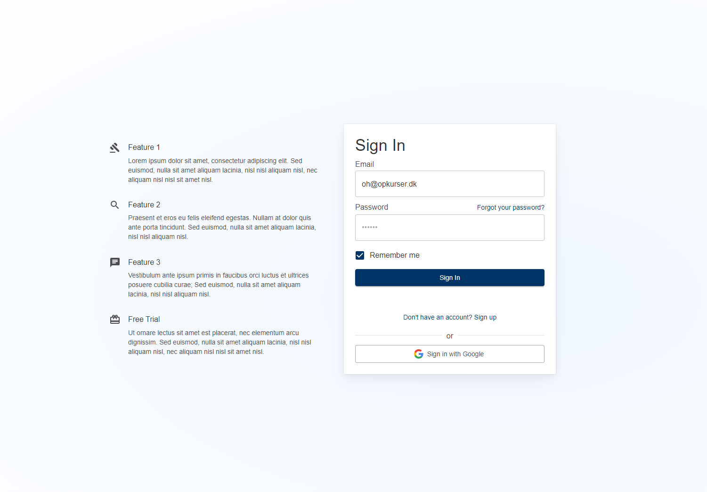
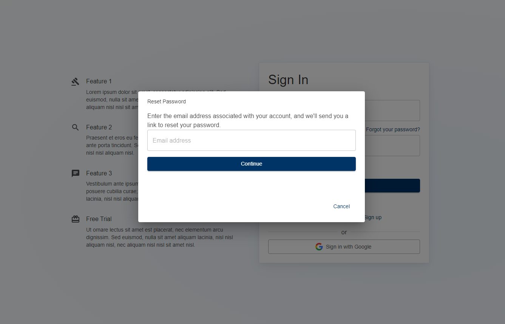
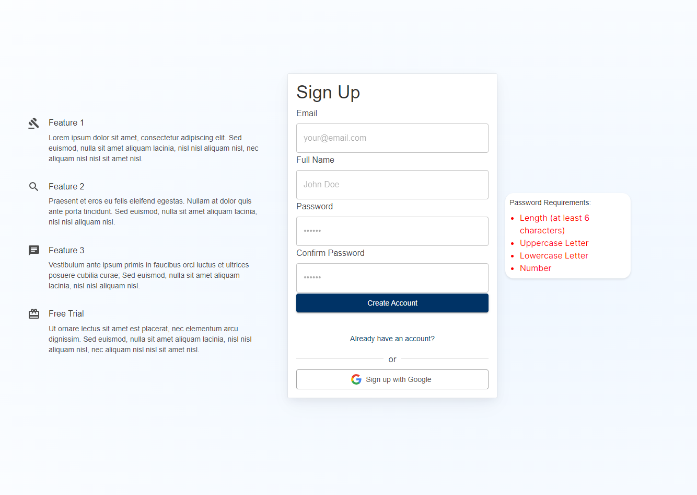
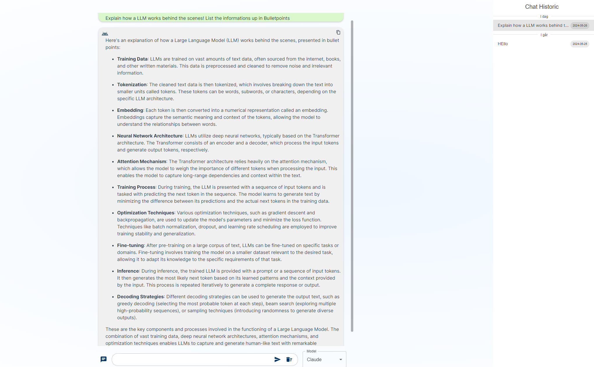
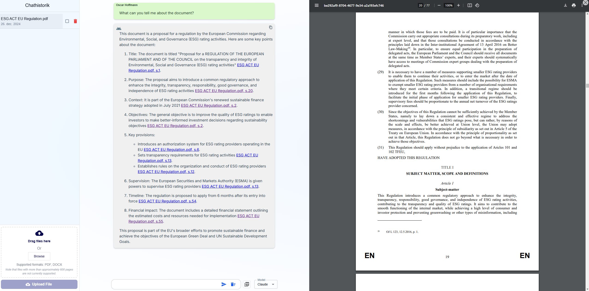

# Supabase Auth with SSR + RAG + Tavily AI Web Search 🔍

## Project Showcase

### Images

<div style="display: flex; justify-content: center; align-items: center; flex-wrap: wrap;">
  
  
  
  
  
  
  
 
  
 
</div>

### Videos

You can find the videos located inside the public folder!

## CHANGELOG

## [v1.8.1] - 2024-12-30

### Added

- **PG Vector Integration**:
- Replaced Pinecone with Supabase's pgvector for document embeddings storage and similarity search.

### Why Replace Pinecone?

While Pinecone is popular, it presented significant challenges in production:

- **Lack of Type Safety**:

  - No proper TypeScript support
  - Difficult to maintain type consistency
  - Error-prone metadata management

- **Data Management Nightmare**:

  - No SQL support for updating metadata
  - Having to maintain data in two separate systems
  - Complex and limited update operations

- **Support and Cost Issues**:
  - Unresponsive support team
  - Limited help with technical issues
  - Expensive serverless pricing model

### Benefits of Supabase pgvector

The migration to pgvector provides:

- **Unified Data Layer**:

  - Single database for all application data
  - Native PostgreSQL features
  - Built-in Row Level Security (RLS)

- **Better Development**:

  - Familiar SQL interface
  - Strong type checking
  - Improved debugging tools

- **Enhanced Query Optimization**:
  - Implemented an intelligent query preprocessing step for document similarity search.
  - Query variation generation for improved semantic matching
  - Context-aware query reformulation based on document metadata
  - Automatic deduplication of search results
  - Improved relevance through multi-query aggregation

### Technical Implementation

#### Vector Document Storage

```sql
-- Enable the vector extension
CREATE EXTENSION IF NOT EXISTS vector WITH SCHEMA extensions;

-- Create the vector_documents table
CREATE TABLE IF NOT EXISTS public.vector_documents (
  id uuid NOT NULL DEFAULT gen_random_uuid(),
  user_id uuid NOT NULL,
  embedding extensions.vector(3072),
  text_content text NOT NULL,
  title text NOT NULL,
  timestamp date NOT NULL,
  ai_title text,
  ai_description text,
  ai_maintopics text[],
  ai_keyentities text[],
  filter_tags text,
  page_number integer NOT NULL,
  total_pages integer NOT NULL,
  chunk_number integer NOT NULL,
  total_chunks integer NOT NULL,
  primary_language text,
  created_at timestamptz DEFAULT CURRENT_TIMESTAMP,
  CONSTRAINT vector_documents_pkey PRIMARY KEY (id),
  CONSTRAINT vector_documents_unique_chunk UNIQUE (user_id, title, "timestamp", page_number, chunk_number),
  CONSTRAINT fk_user FOREIGN KEY (user_id) REFERENCES auth.users(id) ON DELETE CASCADE
);

-- Create indexes
CREATE INDEX IF NOT EXISTS idx_vector_documents_user_id ON public.vector_documents USING btree (user_id);
CREATE INDEX IF NOT EXISTS idx_vector_documents_lookup ON public.vector_documents USING btree (
  user_id,
  title,
  "timestamp",
  page_number,
  chunk_number
);

-- Enable RLS
ALTER TABLE public.vector_documents ENABLE ROW LEVEL SECURITY;

-- Optimized RLS Policies for vector_documents
CREATE POLICY "Users can only read their own documents"
ON public.vector_documents
FOR SELECT
TO authenticated
USING (user_id = (SELECT auth.uid()));
```

#### Similarity Search Function

Implemented an efficient similarity search stored procedure:

```sql
CREATE OR REPLACE FUNCTION match_documents(
  query_embedding vector(3072),
  match_count int,
  filter_user_id uuid,
  filter_files text[],
  similarity_threshold float
)
RETURNS TABLE (
  id uuid,
  text_content text,
  title text,
  doc_timestamp date,
  ai_title text,
  ai_description text,
  ai_maintopics text[],
  ai_keyentities text[],
  filter_tags text,
  page_number int,
  total_pages int,
  chunk_number int,
  total_chunks int,
  similarity float
)
LANGUAGE plpgsql
AS $$
BEGIN
  RETURN QUERY
  SELECT
    vd.id,
    vd.text_content,
    vd.title,
    vd."timestamp" as doc_timestamp,
    vd.ai_title,
    vd.ai_description,
    vd.ai_maintopics,
    vd.ai_keyentities,
    vd.filter_tags,
    vd.page_number,
    vd.total_pages,
    vd.chunk_number,
    vd.total_chunks,
    1 - (vd.embedding <=> query_embedding) as similarity
  FROM
    vector_documents vd
  WHERE
    vd.user_id = filter_user_id
    AND vd.filter_tags = ANY(filter_files)
    AND 1 - (vd.embedding <=> query_embedding) > similarity_threshold
  ORDER BY
    vd.embedding <=> query_embedding ASC
  LIMIT LEAST(match_count, 200);
END;
$$;
```

For more information about implementing vector similarity search with pgvector, check out [Supabase's Vector Columns and Embeddings Guide](https://supabase.com/docs/guides/ai/vector-columns?queryGroups=database-method&database-method=dashboard).

### Improved

- **Performance**: Significant reduction in query latency by eliminating external API calls
- **Cost Efficiency**: Reduced operational costs by using native PostgreSQL capabilities
- **Reliability**: Improved system stability with fewer external dependencies
- **Search Quality**: Enhanced search results through intelligent query optimization

### Technical Benefits

- **Co-located Storage**: Vector embeddings stored alongside other application data
- **Simplified Architecture**: Reduced system complexity by eliminating external vector store

## [v1.8.0] - 2024-12-30

### Added

- **Tavily AI Web Search Integration**: Implemented real-time internet search capabilities using Tavily AI's search API.
  - Live web search during chat conversations
  - Source attribution for search results
  - Seamless integration with existing chat interface


### New Features Include:

- **Web Search Capabilities**:

  - Real-time internet searches during conversations
  - Accurate and up-to-date information from reliable sources
  - Source links provided with responses
  - Context-aware search results integrated into chat flow

- **Enhanced Chat Interface**:
  - New search mode toggle in chat interface
  - Visual indicators for active search operations
  - Improved loading states and feedback
  - Seamless switching between chat modes (Regular, PDF, Web Search)

### Improved

- **Loading States**:
  - Implemented robust loading state management
  - Clear visual feedback during operations
  - Smooth transitions between states

### Fixed

- Various UI/UX bugs and improvements
- Enhanced error handling for search operations
- Improved response formatting and display
- Better handling of concurrent operations

## [v1.7.0] - 2024-12-26

### Added

- **Document Chat Feature (RAG)**: Implemented a Retrieval-Augmented Generation system allowing users to chat with their uploaded documents.
  - Document upload and processing capabilities
  - Automatic text extraction and chunking
  - Vector embedding generation using LlamaIndex
  - Storage in Pinecone vector database
  - Context-aware document querying
  - Semantic search across uploaded documents

### New Features Include:

- **Document Processing Pipeline**:

  - Support for multiple document formats (PDF, DOCX)
  - Automatic text extraction and preprocessing
  - Smart document chunking for optimal context retrieval

- **Enhanced Chat Interface**:

  - Document-aware chat responses
  - Source attribution for answers
  - Context highlighting in responses
  - Document management interface
  - Upload progress tracking
  - Document processing status indicators

- **Interactive Document Navigation**:
  - **Split-Screen Interface**: Documents display on the right while chatting on the left
  - **Click-to-Navigate**: Every AI response includes clickable links that automatically navigate to the relevant page in the document
  - **Smart Context**: AI responses include page numbers and brief quotes with clickable navigation

## [v1.6.0] - 2024-06-10

### Added

- **Supabase Integration for Chat Storage**: Replaced Upstash/redis storage of chat messages with Supabase. The AI/RSC part of the application now stores data directly in Supabase tables. This was done to keep everything in one place.

### Changed

- **Database Schema**: Implemented new schemas in Supabase for chat storage. The new schemas are as follows:

  ```sql
  -- Chat Sessions Table
  create table
    public.chat_sessions (
      id uuid not null default extensions.uuid_generate_v4 (),
      user_id uuid not null,
      created_at timestamp with time zone not null default current_timestamp,
      updated_at timestamp with time zone not null default current_timestamp,
      constraint chat_sessions_pkey primary key (id),
      constraint chat_sessions_user_id_fkey foreign key (user_id) references users (id)
    ) tablespace pg_default;

  create index if not exists idx_chat_sessions_user_id on public.chat_sessions using btree (user_id) tablespace pg_default;

  create index if not exists chat_sessions_created_at_idx on public.chat_sessions using btree (created_at) tablespace pg_default;

  -- Enable RLS for chat_sessions
  alter table public.chat_sessions enable row level security;

  -- Chat sessions RLS policy
  create policy "Users can view own chat sessions"
  on public.chat_sessions
  as permissive
  for all
  to public
  using (auth.uid() = user_id);

    -- Chat Messages Table
  create table
    public.chat_messages (
      id uuid not null default extensions.uuid_generate_v4 (),
      chat_session_id uuid not null,
      content text null,
      is_user_message boolean not null,
      sources jsonb null,
      created_at timestamp with time zone not null default current_timestamp,
      constraint chat_messages_pkey primary key (id),
      constraint chat_messages_chat_session_id_fkey foreign key (chat_session_id) references chat_sessions (id) on delete cascade
    ) tablespace pg_default;

  create index if not exists idx_chat_messages_chat_session_id on public.chat_messages using btree (chat_session_id) tablespace pg_default;

  -- Enable RLS for chat_messages
  alter table public.chat_messages enable row level security;

  -- Chat messages RLS policy
  create policy "Users can view messages from their sessions"
  on public.chat_messages
  as permissive
  for all
  to public
  using (
    chat_session_id IN (
      SELECT chat_sessions.id
      FROM chat_sessions
      WHERE chat_sessions.user_id = auth.uid()
    )
  );
  ```

## [v1.5.0] - 2024-06-02

### Added

- **End-to-End Types**: Implemented types for `ServerMessage`, `ClientMessage`, `SubmitMessageResult`, and `ChatHistoryUpdateResult` to ensure type safety from client to server actions.
- **Bug Fixes**: Fixed various bugs throughout the application.
- **Chat History Improvement**: Enhanced the chat history feature in the server action chatbot to load the 30 newest messages initially, with a "load more" button to retrieve the next 30 messages.
- **Perplexity Provider Integration**: Updated the integration of the Perplexity provider to use the `@ai-sdk/openai` module. This involved changing from the old OpenAI configuration to the new `createOpenAI` function from `@ai-sdk/openai`, ensuring compatibility with the Perplexity API. The updated code allows for seamless streaming of text responses and includes better error handling and rate limiting.

## [v1.4.0] - 2024-05-25

### Added

- **Vercel AI SDK Example**: Added an example demonstrating the usage of the new Vercel AI SDK with the `use server` directive. This example showcases how to create a Server Action to query a language model and update the frontend UI accordingly.
- **Chat History**: Implemented a chat history feature that allows users to view and interact with their previous conversations. The chat history is seamlessly integrated into the user interface, enhancing the overall user experience.
- **Streaming UI Feature**: Introduced a real-time streaming UI feature that enables users to see the AI-generated responses as they are being generated. This feature provides a more engaging and interactive experience, mimicking a natural conversation flow.
- **useSWR Package Integration**: Implemented the useSWR package to demonstrate how to efficiently handle server actions and data fetching. The useSWR package provides a simple and powerful way to manage server state, ensuring optimal performance and user experience.

## [v1.3.0] - 2024-05-25

### Added

- **Vercel AI SDK Integration**: Migrated from Langchain to the Vercel AI SDK for a more streamlined and efficient integration with AI models. The Vercel AI SDK provides a simpler and more straightforward approach to interacting with AI models, reducing unnecessary complexity in the codebase.

### Removed

- **Langchain Dependency**: Uninstalled Langchain to simplify the codebase and reduce unnecessary complexity. While Langchain provided useful functionality, it was deemed redundant given the capabilities of the Vercel AI SDK. An example of the previous Langchain integration can still be found in the `exampleWithLangchain.md` file in the package folder for reference.

### Updated

- **Memoized Message Component**: Implemented memoization for the `Message` component using `React.memo`. This optimization helps prevent unnecessary re-renders of the `Message` component by only re-rendering when its props change. Memoization improves performance by reducing the number of re-renders, especially in scenarios with large amounts of messages and frequent updates, such as streaming.

### [v1.2.0] - 2024-05-24

#### Added

- **Enhanced Chat List Deletion**: Improved the chat list deletion process with robust checking and validation using Zod. When a chat is deleted, only the associated tag is revalidated, optimizing cache management and avoiding unnecessary clearing of the entire cache for the `aichat` component.

- **Upgraded Chat Component**: Enriched the chat component with a range of new features and enhancements:
  - Expanded support for multiple AI models, including GPT-3.5, GPT-4, and Claude AI Opus, catering to diverse user preferences.
  - Implemented a responsive design that dynamically adjusts the chat width and size based on screen size, responsize screensize across devices.
  - Added a convenient "scroll to top" button for effortless navigation within lengthy chat conversations.
  - Improved error handling and introduced user-friendly error messages to guide users and maintain a smooth interaction flow.
  - Enabled copy-to-clipboard functionality for assistant messages, allowing users to easily capture and share AI-generated responses.
  - Enhanced code block rendering with syntax highlighting and language detection, providing a visually appealing and readable format for shared code snippets.
  - Upgraded the chat input area with multiline support, retry and stop buttons, and optimized integration with the selected AI model, enhancing the overall user input experience.

### [v1.1.0] - 2024-05-23

#### Added

- **Swipeable Chat List Drawers**: Introduced swipeable chat list drawers, enhancing the mobile user experience by providing intuitive navigation and management of chats.
- **Claude AI Opus Integration**: Expanded the available AI models by integrating Claude AI Opus, offering users an additional option for their chat interactions.
- **Abort Signal Handling**: Implemented abort signal functionality, allowing users to gracefully cancel ongoing chat requests, improving overall application responsiveness.
- **Partial Chat Save**: Developed a robust partial chat save mechanism. In the event of a user aborting the chat mid-stream or a stream failure, the application now stores the generated content up to that point, minimizing data loss and ensuring a more reliable user experience.

#### Updated

- **Optimized Drawer Rendering**: Enhanced drawer rendering performance for users with numerous chats by leveraging `useMemo` to minimize unnecessary re-renders, resulting in a smoother and more efficient user interface.
- **Optimized UseChat Component**: Improved the `UseChat` component's responsiveness and performance across various screen sizes, providing a consistent and optimized user experience.

### [v1.0.0] - 2024-05-22

#### Added

- **Latest AI Package**: Upgraded to the most recent AI package from Vercel, leveraging the latest advancements in artificial intelligence technology.
- **Langchain Upgrade**: Updated to the newest version of Langchain, enhancing the integration and communication between the application and AI models.
- **Chat History Feature**: Introduced chat history feature, enabling users to easily access and reference their previous conversations.
- **Mobile-Friendly Chat**: Implemented a responsive chat interface that dynamically adapts its width and size based on the user's screen size, ensuring optimal usability across various devices.
- **Modern Authentication Pages**: Revamped the `/auth` page with a sleek and professional design for sign-in, sign-up, and password reset flows, elevating the overall user experience and visual appeal.

## Table of Contents

- [Features](#features)
- [Getting Started](#getting-started)
  - [Prerequisites](#prerequisites)
  - [Installation](#installation)
  - [Database Setup](#database-setup)
  - [Environment Variables](#environment-variables)
- [Document Processing Setup](#document-processing-setup)
- [Usage](#usage)
- [Email Templates](#email-templates)
- [Chat Interface Integration](#chat-interface-integration)
- [License](#license)
- [Acknowledgements](#acknowledgements)
- [Packages Used](#packages-used)

## Features

- **Robust Authentication**: Utilize Supabase's comprehensive auth capabilities alongside SSR for enhanced security.
- **Performance**: Leverage server-side rendering for faster load times and improved user experience.
- **Next.js Integration**: Specifically designed for easy integration with Next.js 14 projects.

## Getting Started

### Prerequisites

- A [Supabase account](https://supabase.io/)
- An existing [Next.js](https://nextjs.org/) project setup

### Installation

1. **Clone the Repository**

   ```bash
   git clone https://github.com/ElectricCodeGuy/SupabaseAuthWithSSR.git
   ```

2. **Navigate to the Project Directory**

   ```bash
   cd SupabaseAuthWithSSR
   ```

3. **Install Required Packages**

   ```bash
   npm install
   ```

### Database Setup

Before launching your application, you must configure the database schema within Supabase.

1. **Create the Users Table**

   ```sql
   create table users (
     -- UUID from auth.users
     id uuid references auth.users not null primary key,
     full_name text,
     email text
   );
   ```

   This SQL statement creates a `users` table with columns for storing user data such as `id`, `full_name`. The `id` column is a foreign key referencing the `auth.users` table.

   These SQL statements enable Row Level Security (RLS) on the `users` table and create policies to allow users to view and update their own data.

2. **Create a Trigger Function**

   ```sql
   create function public.handle_new_user()
   returns trigger as $$
   begin
    insert into public.users (id, full_name, email)
    values (
      new.id,
      new.raw_user_meta_data->>'full_name',
      new.email
    );
    return new;
   end;
   $$ language plpgsql security definer;
   ```

This SQL function is a trigger function that automatically inserts a new user entry into the `public.users` table when a new user signs up via Supabase Auth. It extracts the `id`, `full_name` from the `auth.users` table and inserts them into the corresponding columns in the `public.users` table.

3. **Create a Trigger**

   ```sql
   create trigger on_auth_user_created
     after insert on auth.users
     for each row execute procedure public.handle_new_user();
   ```

This SQL statement creates a trigger named `on_auth_user_created` that executes the `public.handle_new_user()` function after each new user is inserted into the `auth.users` table.

4. **Sign Up for an Account**

- Navigate to `http://localhost:3000/auth` in your web browser.
- Use the sign-up form to create an account. Ensure you use a valid email address that you have access to, as you'll need to verify it in the next step.

5. **Verify Your Email**

- After signing up, Supabase will send an email to the address you provided. Check your inbox for an email from Supabase or your application.
- Open the email and click on the verification link to confirm your email address. This step is crucial for activating your account and ensuring that you can log in and access the application's features.

6. **Make the rest of the tables, RLS and RPC**

```sql


  -- Chat Sessions Table
  create table
    public.chat_sessions (
      id uuid not null default extensions.uuid_generate_v4 (),
      user_id uuid not null,
      created_at timestamp with time zone not null default current_timestamp,
      updated_at timestamp with time zone not null default current_timestamp,
      constraint chat_sessions_pkey primary key (id),
      constraint chat_sessions_user_id_fkey foreign key (user_id) references users (id)
    ) tablespace pg_default;

  create index if not exists idx_chat_sessions_user_id on public.chat_sessions using btree (user_id) tablespace pg_default;

  create index if not exists chat_sessions_created_at_idx on public.chat_sessions using btree (created_at) tablespace pg_default;

  -- Chat Messages Table
  create table
    public.chat_messages (
      id uuid not null default extensions.uuid_generate_v4 (),
      chat_session_id uuid not null,
      content text null,
      is_user_message boolean not null,
      sources jsonb null,
      created_at timestamp with time zone not null default current_timestamp,
      constraint chat_messages_pkey primary key (id),
      constraint chat_messages_chat_session_id_fkey foreign key (chat_session_id) references chat_sessions (id) on delete cascade
    ) tablespace pg_default;

  create index if not exists idx_chat_messages_chat_session_id on public.chat_messages using btree (chat_session_id) tablespace pg_default;
  -- Enable RLS for chat_messages
  alter table public.chat_messages enable row level security;

  -- Chat messages RLS policy
  create policy "Users can view messages from their sessions"
  on public.chat_messages
  as permissive
  for all
  to public
  using (
    chat_session_id IN (
      SELECT chat_sessions.id
      FROM chat_sessions
      WHERE chat_sessions.user_id = auth.uid()
    )
  );

-- Enable the vector extension
CREATE EXTENSION IF NOT EXISTS vector WITH SCHEMA extensions;

-- Create the vector_documents table
CREATE TABLE IF NOT EXISTS public.vector_documents (
  id uuid NOT NULL DEFAULT gen_random_uuid(),
  user_id uuid NOT NULL,
  embedding extensions.vector(3072),
  text_content text NOT NULL,
  title text NOT NULL,
  timestamp date NOT NULL,
  ai_title text,
  ai_description text,
  ai_maintopics text[],
  ai_keyentities text[],
  filter_tags text,
  page_number integer NOT NULL,
  total_pages integer NOT NULL,
  chunk_number integer NOT NULL,
  total_chunks integer NOT NULL,
  primary_language text,
  created_at timestamptz DEFAULT CURRENT_TIMESTAMP,
  CONSTRAINT vector_documents_pkey PRIMARY KEY (id),
  CONSTRAINT vector_documents_unique_chunk UNIQUE (user_id, title, "timestamp", page_number, chunk_number),
  CONSTRAINT fk_user FOREIGN KEY (user_id) REFERENCES auth.users(id) ON DELETE CASCADE
);

-- Create indexes
CREATE INDEX IF NOT EXISTS idx_vector_documents_user_id ON public.vector_documents USING btree (user_id);
CREATE INDEX IF NOT EXISTS idx_vector_documents_lookup ON public.vector_documents USING btree (
  user_id,
  title,
  "timestamp",
  page_number,
  chunk_number
);

-- Enable RLS
ALTER TABLE public.vector_documents ENABLE ROW LEVEL SECURITY;

-- Optimized RLS Policies for vector_documents
CREATE POLICY "Users can only read their own documents"
ON public.vector_documents
FOR SELECT
TO authenticated
USING (user_id = (SELECT auth.uid()));

-- Users Table RLS Policies
CREATE POLICY "Users can insert own data"
ON public.users
FOR INSERT
TO public
WITH CHECK (id = (SELECT auth.uid()));

CREATE POLICY "Users can update own data"
ON public.users
FOR UPDATE
TO public
USING (id = (SELECT auth.uid()))
WITH CHECK (id = (SELECT auth.uid()));

CREATE POLICY "Users can view own data"
ON public.users
FOR SELECT
TO public
USING (id = (SELECT auth.uid()));

-- Chat Sessions RLS Policies
CREATE POLICY "Users can view own chat sessions"
ON public.chat_sessions
AS PERMISSIVE
FOR ALL
TO public
USING (user_id = (SELECT auth.uid()));

-- Chat Messages RLS Policies
CREATE POLICY "Users can view messages from their sessions"
ON public.chat_messages
AS PERMISSIVE
FOR ALL
TO public
USING (
  chat_session_id IN (
      SELECT chat_sessions.id
      FROM chat_sessions
      WHERE chat_sessions.user_id = (SELECT auth.uid())
  )
);

-- Create the similarity search function
CREATE OR REPLACE FUNCTION match_documents(
  query_embedding vector(3072),
  match_count int,
  filter_user_id uuid,
  filter_files text[],
  similarity_threshold float DEFAULT 0.70
)
RETURNS TABLE (
  id uuid,
  text_content text,
  title text,
  doc_timestamp date,
  ai_title text,
  ai_description text,
  ai_maintopics text[],
  ai_keyentities text[],
  filter_tags text,
  page_number int,
  total_pages int,
  chunk_number int,
  total_chunks int,
  similarity float
)
LANGUAGE plpgsql
AS $$
BEGIN
  RETURN QUERY
  SELECT
      vd.id,
      vd.text_content,
      vd.title,
      vd."timestamp" as doc_timestamp,
      vd.ai_title,
      vd.ai_description,
      vd.ai_maintopics,
      vd.ai_keyentities,
      vd.filter_tags,
      vd.page_number,
      vd.total_pages,
      vd.chunk_number,
      vd.total_chunks,
      1 - (vd.embedding <=> query_embedding) as similarity
  FROM
      vector_documents vd
  WHERE
      vd.user_id = filter_user_id
      AND vd.filter_tags = ANY(filter_files)
      AND 1 - (vd.embedding <=> query_embedding) > similarity_threshold
  ORDER BY
      vd.embedding <=> query_embedding ASC
  LIMIT LEAST(match_count, 200);
END;
$$;
```

# Document Processing Setup

To enable document upload and chat functionality, you'll need additional API keys:

1. **LlamaIndex Cloud Setup**

- Visit [LlamaIndex Cloud](https://cloud.llamaindex.ai/)
- Create an account and get your API key
- Add to `.env.local`:
  ```
  LLAMA_CLOUD_API_KEY=your_api_key_here
  ```

These services enable document processing, embedding storage, and semantic search capabilities in your chat interface.

### Storage Setup and RLS

After setting up the basic database structure, you need to configure storage and its associated security policies in Supabase.

1. **Create Storage Bucket**

First, create a storage bucket named 'userfiles' in your Supabase dashboard:

- Go to Storage in your Supabase dashboard
- Click "Create Bucket"
- Name it "userfiles"
- Set it to private

2. **Configure Storage RLS Policies**

Add the following policies to secure your storage. These policies ensure users can only access their own files and folders.

```sql
-- Policy 1: Allow users to select their own files
create policy "User can select own files"
on storage.objects for select
using ((bucket_id = 'userfiles'::text) AND
       ((auth.uid())::text = (storage.foldername(name))[1]));

-- Policy 2: Allow users to insert their own files
create policy "User can insert own files"
on storage.objects for insert
with check ((bucket_id = 'userfiles'::text) AND
            ((auth.uid())::text = (storage.foldername(name))[1]));

-- Policy 3: Allow users to update their own files
create policy "User can update own files"
on storage.objects for update
using ((bucket_id = 'userfiles'::text) AND
       ((auth.uid())::text = (storage.foldername(name))[1]));

-- Policy 4: Allow users to delete their own files
create policy "User can delete own files"
on storage.objects for delete
using ((bucket_id = 'userfiles'::text) AND
       ((auth.uid())::text = (storage.foldername(name))[1]));

-- Policy 5: Allow public select access to objects
create policy "Allow public select access"
on storage.objects for select
using (true);
```

These policies accomplish the following:

- Policies 1-4 ensure users can only manage (select, insert, update, delete) files within their own user directory
- Policy 5 allows public select access to all objects, which is necessary for certain Supabase functionality

The `storage.foldername(name)[1]` function extracts the first part of the file path, which should match the user's ID.

3. **Verify Configuration**

After setting up these policies:

- Users can only access files in their own directory
- Files are organized by user ID automatically
- Public select access is maintained for system functionality
- All other operations are restricted to file owners only

### Environment Variables

Configure your environment by renaming `.env.local.example` to `.env.local` and updating it with your Supabase project details:

- `NEXT_PUBLIC_SUPABASE_URL`: Your Supabase project URL.
- `NEXT_PUBLIC_SUPABASE_ANON_KEY`: Your Supabase anon (public) key.

**Document Processing:**

- `LLAMA_CLOUD_API_KEY`: Your LlamaIndex Cloud API key

Optional variables for extended functionality:

- `SUPABASE_SERVICE_ROLE_KEY`
- `SUPABASE_ACCESS_TOKEN`
- `NEXT_PUBLIC_CLIENT_ID`
- `CLIENT_SECRET`

For third-party auth configurations, include:

- `GITHUB_CLIENT_ID`
- `GITHUB_SECRET_ID`
- `GOOGLE_CLIENT_ID`
- `GOOGLE_SECRET_ID`

For Openai, Perplexity and Upstash/Redis

- `PERPLEXITY_API_KEY=`
- `OPENAI_API_KEY=`
- `UPSTASH_REDIS_REST_URL=`
- `UPSTASH_REDIS_REST_TOKEN=`

## 🔍 Usage

📖 Follow the provided examples to integrate Supabase Auth with SSR in your Next.js project.

## 📧 Email Templates

To ensure that the authentication flow works correctly with the API routes provided in this codebase, please update your email templates in the Supabase project settings according to the templates provided below:

### Confirm Your Signup

When users sign up, they'll receive an email to confirm their account. The template should look like this:

```html
<!doctype html>
<html>
  <head>
    <title>Confirm Your Signup</title>
    <!-- Add styles and head content here -->
  </head>
  <body>
    <div class="container">
      <div class="header">
        <h1>Welcome to You Company Name</h1>
      </div>

      <h2>Confirm your signup</h2>
      <p>Follow this link to confirm your user:</p>
      <a
        href="{{ .SiteURL }}/api/auth/callback?token_hash={{ .TokenHash }}&type=email"
        >Confirm your email</a
      >
    </div>
  </body>
</html>
```

Invite User Email When you invite new users to your platform, they should
receive an invitation like this:

```html
<h2>You have been invited</h2>
<p>
  You have been invited to create a user on {{ .SiteURL }}. Follow this link to
  accept the invite:
</p>
<a
  href="{{ .SiteURL }}/api/auth/callback?token_hash={{ .TokenHash }}&type=invite&next=/auth-password-update"
  >Accept the invite</a
>
```

Magic Link Email For passwordless login, the magic link email template should be
set as follows:

```html
<h2>Magic Link</h2>
<p>Follow this link to login:</p>
<a
  href="{{ .SiteURL }}/api/auth/callback?token_hash={{ .TokenHash }}&type=email"
  >Log In</a
>
```

Confirm Email Change When users need to confirm their new email, use the
following template:

```html
<h2>Confirm Change of Email</h2>
<p>
  Follow this link to confirm the update of your email from {{ .Email }} to {{
  .NewEmail }}:
</p>
<a href="{{ .ConfirmationURL }}">Change Email</a>
```

Reset Password Email For users that have requested a password reset:

```html
<h2>Reset Password</h2>
<p>Follow this link to reset the password for your user:</p>
<a
  href="{{ .SiteURL }}/api/auth/callback?token_hash={{ .TokenHash }}&type=recovery&next=/auth-password-update"
  >Reset Password</a
>
```

## 📜 License

🔖 Licensed under the MIT License. See LICENSE.md for details.

```

```

```

```
