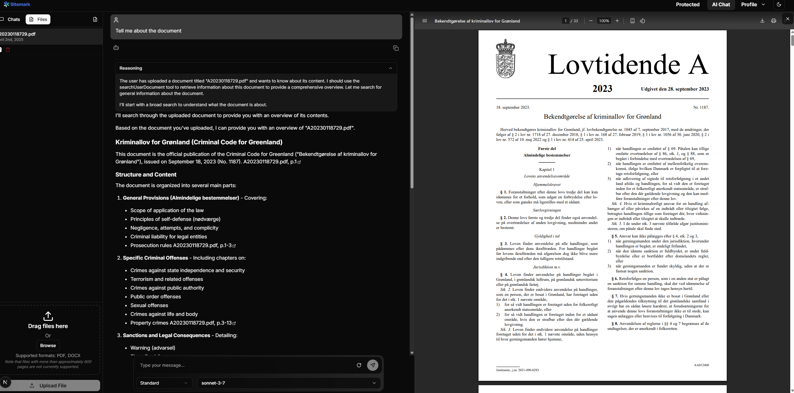
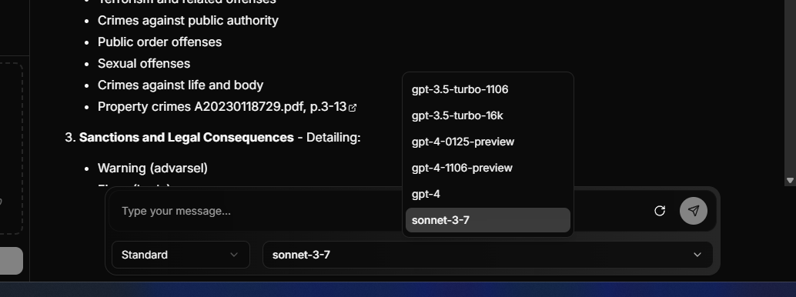
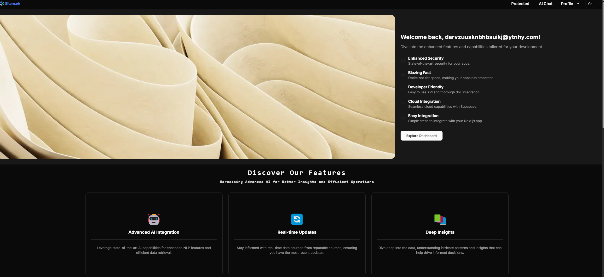
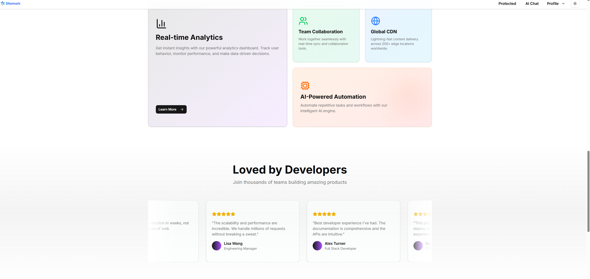
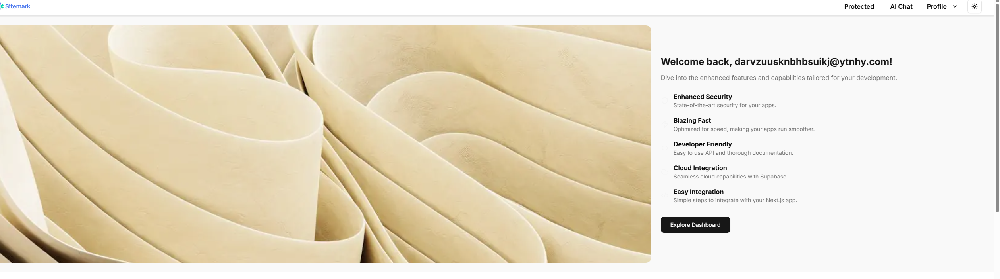
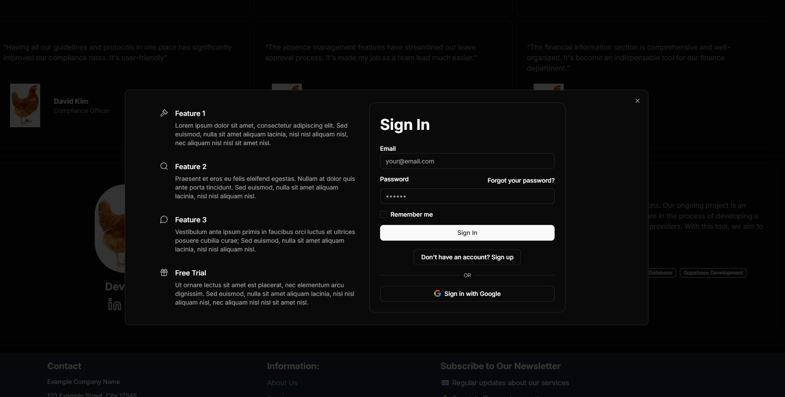
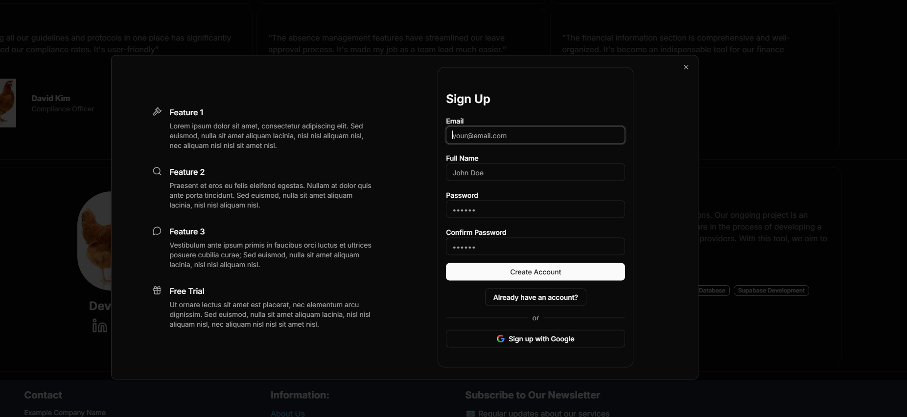
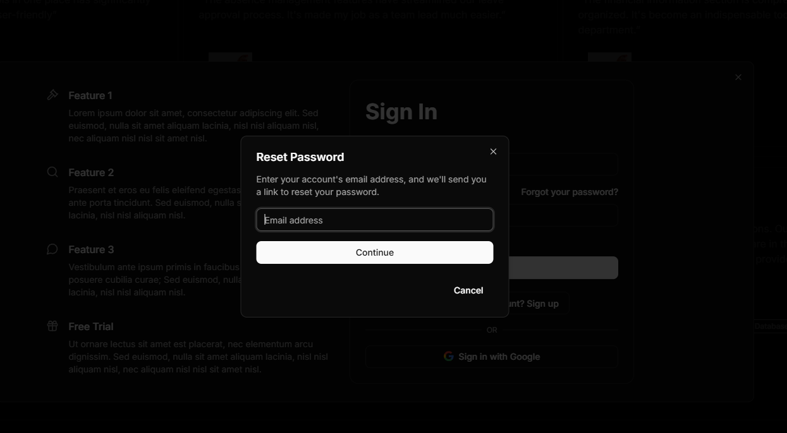

# Supabase Auth with SSR + RAG + Tavily AI Web Search 🔍

## Project Showcase

### Images

<div style="display: flex; justify-content: center; align-items: center; flex-wrap: wrap;">
  
  
  
  
  
  
  
  
  
</div>

### Videos

You can find the videos located inside the public folder!

## Table of Contents

- [Features](#features)
- [Getting Started](#getting-started)
  - [Prerequisites](#prerequisites)
  - [Installation](#installation)
  - [Database Setup](#database-setup)
  - [Document Processing Setup](#document-processing-setup)
  - [Storage Setup and RLS](#storage-setup-and-rls)
  - [Environment Variables](#environment-variables)
- [Email Templates](#email-templates)
  - [Confirm Your Signup](#confirm-your-signup)
  - [Invite User Email](#invite-user-email)
  - [Magic Link Email](#magic-link-email)
  - [Confirm Email Change](#confirm-email-change)
  - [Reset Password Email](#reset-password-email)
- [Code Structure and Philosophy](#code-structure-and-philosophy)
  - [Code Organization Over Design Patterns](#code-organization-over-design-patterns)
  - [Intentional Code Duplication Examples](#intentional-code-duplication-examples)
- [License](#license)

## Features

- **Robust and easy authentication**: Utilize Supabase's auth capabilities alongside SSR for security.
- **Performance**: Leverage server-side rendering for faster load times and improved user experience.
- **Next.js Integration**: Specifically designed for easy integration with Next.js 15 projects.

## Getting Started

### Prerequisites

- A [Supabase account](https://supabase.io/)

**If you want to use the AI features the following keys are needed**

- A Llarma Cloud account [LlamaCloud](https://cloud.llamaindex.ai/) (for parsing pdf files into markdown)
- An Upstash redis account [Upstash](https://upstash.com/) (for ratelimiting and caching)
- A Tavily account for searching the internet using the AI [Tavily](https://tavily.com/)
- A Openai API key [OpenaiAPI](https://platform.openai.com/docs/overview)
- A Anthripic API key [Antropic](https://console.anthropic.com/dashboard)
- A perplexity API key [Perplexity](https://docs.perplexity.ai/home)
- A Langfuse API key [Langfuse](https://cloud.langfuse.com/) (for telemetry for the AI chat, https://sdk.vercel.ai/providers/observability/langfuse)

### Installation

1. **Clone the Repository**

   ```bash
   git clone https://github.com/ElectricCodeGuy/SupabaseAuthWithSSR.git
   ```

2. **Navigate to the Project Directory**

   ```bash
   cd SupabaseAuthWithSSR
   ```

3. **Install Required Packages**

   ```bash
   npm install
   ```

### Database Setup

Before launching your application, you must configure the database schema within Supabase. Navigate to supabase SQL editor and use the following SQL queries to setup the schemas

1. **Create the Users Table**

```sql
-- Create users table
create table users (
  id uuid references auth.users not null primary key,
  full_name text,
  email text
);

-- Enable Row Level Security (RLS)
alter table public.users enable row level security;

-- Create RLS policies for users table
create policy "Users can insert own data"
on public.users
for insert
to public
with check (id = auth.uid());

create policy "Users can update own data"
on public.users
for update
to public
using (id = auth.uid())
with check (id = auth.uid());

create policy "Users can view own data"
on public.users
for select
to public
using (id = auth.uid());
```

This SQL statement creates a `users` table with columns for storing user data such as `id`, `full_name` and `email`. The `id` column is a foreign key referencing the `auth.users` table. It also enables RLS for the users table allowing users to read, insert and update their own data

2. **Create a Trigger Function**

   ```sql
   create function public.handle_new_user()
   returns trigger as $$
   begin
    insert into public.users (id, full_name, email)
    values (
      new.id,
      new.raw_user_meta_data->>'full_name',
      new.email
    );
    return new;
   end;
   $$ language plpgsql security definer;
   ```

This SQL function is a trigger function that automatically inserts a new user entry into the `public.users` table when a new user signs up via Supabase Auth. It extracts the `id`, `full_name` and `email` from the `auth.users` table and inserts them into the corresponding columns in the `public.users` table.

3. **Create a Trigger**

   ```sql
   create trigger on_auth_user_created
     after insert on auth.users
     for each row execute procedure public.handle_new_user();
   ```

This SQL statement creates a trigger named `on_auth_user_created` that executes the `public.handle_new_user()` function after each new user is inserted into the `auth.users` table.

4. **Sign Up for an Account**

- Navigate to `http://localhost:3000/signup` in your web browser.
- Use the sign-up form to create an account. Ensure you use a valid email address that you have access to, as you'll need to verify it in the next step.

5. **Verify Your Email**

- After signing up, Supabase will send an email to the address you provided. Check your inbox for an email from Supabase or your application.
- Open the email and click on the verification link to confirm your email address. This step is crucial for activating your account and ensuring that you can log in and access the application's features.

6. **Make the rest of the tables, RLS and RPC**

```sql


  -- Chat Sessions Table
  create table
    public.chat_sessions (
      id uuid not null default extensions.uuid_generate_v4 (),
      user_id uuid not null,
      created_at timestamp with time zone not null default current_timestamp,
      updated_at timestamp with time zone not null default current_timestamp,
      chat_title null,
      constraint chat_sessions_pkey primary key (id),
      constraint chat_sessions_user_id_fkey foreign key (user_id) references users (id)
    ) tablespace pg_default;

  create index if not exists idx_chat_sessions_user_id on public.chat_sessions using btree (user_id) tablespace pg_default;

  create index if not exists chat_sessions_created_at_idx on public.chat_sessions using btree (created_at) tablespace pg_default;

  -- Chat Messages Table
  create table
    public.chat_messages (
      id uuid not null default extensions.uuid_generate_v4 (),
      chat_session_id uuid not null,
      content text null,
      is_user_message boolean not null,
      sources jsonb null,
      attachments jsonb null,
      tool_invocations null,
      created_at timestamp with time zone not null default current_timestamp,
      constraint chat_messages_pkey primary key (id),
      constraint chat_messages_chat_session_id_fkey foreign key (chat_session_id) references chat_sessions (id) on delete cascade
    ) tablespace pg_default;

  create index if not exists idx_chat_messages_chat_session_id on public.chat_messages using btree (chat_session_id) tablespace pg_default;
  -- Enable RLS for chat_messages
  alter table public.chat_messages enable row level security;

  -- Chat messages RLS policy
  create policy "Users can view messages from their sessions"
  on public.chat_messages
  as permissive
  for all
  to public
  using (
    chat_session_id IN (
      SELECT chat_sessions.id
      FROM chat_sessions
      WHERE chat_sessions.user_id = auth.uid()
    )
  );

-- Enable the vector extension
CREATE EXTENSION IF NOT EXISTS vector WITH SCHEMA extensions;

-- Note: PostgreSQL currently does not support indexing vectors with more than 2,000 dimensions. If you have hundreds of thousands of documents resulting in hundreds of thousands of vectors, you need to use an embedding model that produces 2,000 dimensions or fewer.

# Vector Database Configuration for Efficient Similarity Search

When dealing with hundreds of thousands of document vectors, optimizing for both storage and retrieval speed is critical. Our system has been configured using the following best practices:


-- Create the vector_documents table
CREATE TABLE public.user_documents (
  id uuid NOT NULL DEFAULT gen_random_uuid(),
  user_id uuid NOT NULL,
  title text NOT NULL,
  total_pages integer NOT NULL,
  ai_description text NULL,
  ai_keyentities text[] NULL,
  ai_maintopics text[] NULL,
  ai_title text NULL,
  filter_tags text NOT NULL,
  created_at timestamp with time zone NOT NULL DEFAULT CURRENT_TIMESTAMP,
  updated_at timestamp with time zone NULL DEFAULT CURRENT_TIMESTAMP,
  CONSTRAINT user_documents_pkey PRIMARY KEY (id),
  CONSTRAINT user_documents_user_title_unique UNIQUE (user_id, title),
  CONSTRAINT user_documents_user_id_fkey FOREIGN KEY (user_id) REFERENCES users (id) ON DELETE CASCADE
) TABLESPACE pg_default;

-- Separate vector embeddings table
CREATE TABLE public.user_documents_vec (
  id uuid NOT NULL DEFAULT gen_random_uuid(),
  document_id uuid NOT NULL,
  text_content text NOT NULL,
  page_number integer NOT NULL,
  embedding extensions.vector(1024) NULL,
  CONSTRAINT user_documents_vec_pkey PRIMARY KEY (id),
  CONSTRAINT user_documents_vec_document_page_unique UNIQUE (document_id, page_number),
  CONSTRAINT user_documents_vec_document_id_fkey FOREIGN KEY (document_id) REFERENCES user_documents (id) ON DELETE CASCADE
) TABLESPACE pg_default;

ALTER TABLE public.user_documents ENABLE ROW LEVEL SECURITY;
ALTER TABLE public.user_documents_vec ENABLE ROW LEVEL SECURITY;

-- RLS policy for user_documents - users can only access their own documents
CREATE POLICY "Users can only access their own documents" ON public.user_documents
    FOR ALL
    TO public
    USING ((SELECT auth.uid()) = user_id);

CREATE POLICY "Users can only access their own document vectors" ON public.user_documents_vec
    FOR ALL
    TO public
    USING (
        EXISTS (
            SELECT 1 FROM user_documents
            WHERE user_documents.id = user_documents_vec.document_id
            AND user_documents.user_id = (SELECT auth.uid())
        )
    );


-- Create indexes for better performance
CREATE INDEX IF NOT EXISTS idx_user_documents_user_id
ON public.user_documents USING btree (user_id) TABLESPACE pg_default;

CREATE INDEX IF NOT EXISTS idx_user_documents_filter_tags
ON public.user_documents USING btree (filter_tags) TABLESPACE pg_default;

CREATE INDEX IF NOT EXISTS idx_user_documents_vec_document_id
ON public.user_documents_vec USING btree (document_id) TABLESPACE pg_default;

-- Create HNSW index for vector similarity search
CREATE INDEX IF NOT EXISTS user_documents_vec_embedding_idx
ON public.user_documents_vec
USING hnsw (embedding extensions.vector_l2_ops)
WITH (m = '16', ef_construction = '64')
TABLESPACE pg_default;


## HNSW Index Configuration

The Hierarchical Navigable Small World (HNSW) index is configured with:

- **m = 16**: Maximum number of connections per layer
- **ef_construction = 64**: Size of the dynamic candidate list during construction

These parameters balance build time, index size, and query performance for our document volumes. The HNSW index drastically improves vector similarity search performance while maintaining high recall rates.

## Why These Parameters?

- **Dimension Size (1024)**: Our embedding model (voyage-3-large) produces 1024-dimensional vectors, well under the pgvector 2000-dimension limit
- **HNSW Algorithm**: Offers logarithmic search complexity, critical for large document collections
- **Cosine Similarity**: Best metric for normalized document embeddings

These optimizations enable sub-second query times even with hundreds of thousands of document vectors in the database.

Above 500k rows you should consider increasing m and ef_construction to m = '32' and ef_construction = '128'

-- Enable RLS
ALTER TABLE public.vector_documents ENABLE ROW LEVEL SECURITY;

-- Optimized RLS Policies for vector_documents
CREATE POLICY "Users can only read their own documents"
ON public.vector_documents
FOR SELECT
TO authenticated
USING (user_id = (SELECT auth.uid()));

-- Users Table RLS Policies
CREATE POLICY "Users can insert own data"
ON public.users
FOR INSERT
TO public
WITH CHECK (id = (SELECT auth.uid()));

CREATE POLICY "Users can update own data"
ON public.users
FOR UPDATE
TO public
USING (id = (SELECT auth.uid()))
WITH CHECK (id = (SELECT auth.uid()));

CREATE POLICY "Users can view own data"
ON public.users
FOR SELECT
TO public
USING (id = (SELECT auth.uid()));

-- Chat Sessions RLS Policies
CREATE POLICY "Users can view own chat sessions"
ON public.chat_sessions
AS PERMISSIVE
FOR ALL
TO public
USING (user_id = (SELECT auth.uid()));

-- Chat Messages RLS Policies
CREATE POLICY "Users can view messages from their sessions"
ON public.chat_messages
AS PERMISSIVE
FOR ALL
TO public
USING (
  chat_session_id IN (
      SELECT chat_sessions.id
      FROM chat_sessions
      WHERE chat_sessions.user_id = (SELECT auth.uid())
  )
);

-- Create the similarity search function
CREATE OR REPLACE FUNCTION match_documents(
  query_embedding vector(1024),
  match_count int,
  filter_user_id uuid,
  filter_files text[],
  similarity_threshold float DEFAULT 0.30
)
RETURNS TABLE (
  id uuid,
  text_content text,
  title text,
  doc_timestamp timestamp with time zone,
  ai_title text,
  ai_description text,
  ai_maintopics text[],
  ai_keyentities text[],
  filter_tags text,
  page_number integer,
  total_pages integer,
  similarity float
)
LANGUAGE plpgsql
AS $$
BEGIN
  RETURN QUERY
  SELECT
    vec.id,
    vec.text_content,
    doc.title,
    doc.created_at as doc_timestamp,
    doc.ai_title,
    doc.ai_description,
    doc.ai_maintopics,
    doc.ai_keyentities,
    doc.filter_tags,
    vec.page_number,
    doc.total_pages,
    1 - (vec.embedding <=> query_embedding) as similarity
  FROM
    user_documents_vec vec
  INNER JOIN
    user_documents doc ON vec.document_id = doc.id
  WHERE
    doc.user_id = filter_user_id
    AND doc.filter_tags = ANY(filter_files)
    AND 1 - (vec.embedding <=> query_embedding) > similarity_threshold
  ORDER BY
    vec.embedding <=> query_embedding ASC
  LIMIT LEAST(match_count, 200);
END;
$$;
```

# Document Processing Setup

To enable document upload and chat functionality, you'll need additional API keys:

1. **LlamaIndex Cloud Setup**

- Visit [LlamaIndex Cloud](https://cloud.llamaindex.ai/)
- Create an account and get your API key
- Add to `.env.local`:
  ```
  LLAMA_CLOUD_API_KEY=your_api_key_here
  ```

These services enable document processing, embedding storage, and semantic search capabilities in your chat interface.

### Storage Setup and RLS

After setting up the basic database structure, you need to configure storage and its associated security policies in Supabase.

1. **Create Storage Bucket**

First, create a storage bucket named 'userfiles' in your Supabase dashboard:

- Go to Storage in your Supabase dashboard
- Click "Create Bucket"
- Name it "userfiles"
- Set it to private

2. **Configure Storage RLS Policies**

Add the following policies to secure your storage. These policies ensure users can only access their own files and folders.

```sql
-- Policy 1: Allow users to select their own files
create policy "User can select own files"
on storage.objects for select
using ((bucket_id = 'userfiles'::text) AND
       ((auth.uid())::text = (storage.foldername(name))[1]));

-- Policy 2: Allow users to insert their own files
create policy "User can insert own files"
on storage.objects for insert
with check ((bucket_id = 'userfiles'::text) AND
            ((auth.uid())::text = (storage.foldername(name))[1]));

-- Policy 3: Allow users to update their own files
create policy "User can update own files"
on storage.objects for update
using ((bucket_id = 'userfiles'::text) AND
       ((auth.uid())::text = (storage.foldername(name))[1]));

-- Policy 4: Allow users to delete their own files
create policy "User can delete own files"
on storage.objects for delete
using ((bucket_id = 'userfiles'::text) AND
       ((auth.uid())::text = (storage.foldername(name))[1]));

-- Policy 5: Allow public select access to objects
create policy "Allow public select access"
on storage.objects for select
using (true);
```

These policies accomplish the following:

- Policies 1-4 ensure users can only manage (select, insert, update, delete) files within their own user directory
- Policy 5 allows public select access to all objects, which is necessary for certain Supabase functionality

The `storage.foldername(name)[1]` function extracts the first part of the file path, which should match the user's ID.

3. **Verify Configuration**

After setting up these policies:

- Users can only access files in their own directory
- Files are organized by user ID automatically
- Public select access is maintained for system functionality
- All other operations are restricted to file owners only

### Environment Variables

Configure your environment by renaming `.env.local.example` to `.env.local` and updating it with your Supabase project details:

- `NEXT_PUBLIC_SUPABASE_URL`: Your Supabase project URL.
- `NEXT_PUBLIC_SUPABASE_ANON_KEY`: Your Supabase anon (public) key.

**Document Processing:**

- `LLAMA_CLOUD_API_KEY`: Your LlamaIndex Cloud API key

Optional variables for extended functionality:

- `SUPABASE_SERVICE_ROLE_KEY`
- `SUPABASE_ACCESS_TOKEN`
- `NEXT_PUBLIC_CLIENT_ID`
- `CLIENT_SECRET`

For third-party auth configurations, include:

- `GITHUB_CLIENT_ID`
- `GITHUB_SECRET_ID`
- `GOOGLE_CLIENT_ID`
- `GOOGLE_SECRET_ID`

For Openai, Perplexity and Upstash/Redis

- `PERPLEXITY_API_KEY=`
- `OPENAI_API_KEY=`
- `UPSTASH_REDIS_REST_URL=`
- `UPSTASH_REDIS_REST_TOKEN=`

## 📧 Email Templates

To ensure that the authentication flow works correctly with the API routes provided in this codebase, please update your email templates in the Supabase project settings according to the templates provided below:

### Confirm Your Signup

When users sign up, they'll receive an email to confirm their account. The template should look like this:

```html
<!DOCTYPE html>
<html>
  <head>
    <title>Confirm Your Signup</title>
    <!-- Add styles and head content here -->
  </head>
  <body>
    <div class="container">
      <div class="header">
        <h1>Welcome to You Company Name</h1>
      </div>

      <h2>Confirm your signup</h2>
      <p>Follow this link to confirm your user:</p>
      <a
        href="{{ .SiteURL }}/api/auth/callback?token_hash={{ .TokenHash }}&type=email"
        >Confirm your email</a
      >
    </div>
  </body>
</html>
```

Invite User Email When you invite new users to your platform, they should
receive an invitation like this:

```html
<h2>You have been invited</h2>
<p>
  You have been invited to create a user on {{ .SiteURL }}. Follow this link to
  accept the invite:
</p>
<a
  href="{{ .SiteURL }}/api/auth/callback?token_hash={{ .TokenHash }}&type=invite&next=/auth-password-update"
  >Accept the invite</a
>
```

Magic Link Email For passwordless login, the magic link email template should be
set as follows:

```html
<h2>Magic Link</h2>
<p>Follow this link to login:</p>
<a
  href="{{ .SiteURL }}/api/auth/callback?token_hash={{ .TokenHash }}&type=email"
  >Log In</a
>
```

Confirm Email Change When users need to confirm their new email, use the
following template:

```html
<h2>Confirm Change of Email</h2>
<p>
  Follow this link to confirm the update of your email from {{ .Email }} to {{
  .NewEmail }}:
</p>
<a href="{{ .ConfirmationURL }}">Change Email</a>
```

Reset Password Email For users that have requested a password reset:

```html
<h2>Reset Password</h2>
<p>Follow this link to reset the password for your user:</p>
<a
  href="{{ .SiteURL }}/api/auth/callback?token_hash={{ .TokenHash }}&type=recovery&next=/auth-password-update"
  >Reset Password</a
>
```

## Code Structure and Philosophy

### Code Organization Over Design Patterns

While design patterns like Factory Pattern and other "clean code" principles have their place, they often lead to overly complex, hard-to-understand codebases. Different developers have different coding styles and approaches - this is natural and okay. Instead of forcing a specific pattern, we focus on keeping related code together in the same folder, making it easier for everyone to understand and maintain.

### Intentional Code Duplication Examples

1. **Shared Code (Minimal)**
   Only truly universal utilities are shared:

   - `getSession()` for auth
   - Type definitions for database schema
   - Error boundary components

2. **Locality of Behavior**
   Everything else stays with its feature:
   - Custom hooks live in feature directories
   - API route handlers stay with their features
   - State management is feature-specific
   - Types and interfaces specific to a feature stay in that feature's directory

This approach means:

- Each feature directory is a complete, self-contained unit
- No hunting through shared directories to understand a feature
- Changes can be made confidently without side effects
- New developers can understand features by looking in one place

The goal is maximum independence and clarity, even at the cost of some duplication. Rather than creating complex abstractions or following rigid design patterns, we prioritize keeping related code together and making it easy to understand at a glance. Shared code is limited to only the most basic, unchanging utilities that truly serve every part of the application.

### Project Structure Visualization

Below is a comprehensive dependency graph showing how all components and modules in the project are interconnected. This visualization helps understand the project's architecture and component relationships:


This dependency graph illustrates:

- Component hierarchies and their relationships
- Module dependencies across the application
- Import/Export relationships between files
- The overall architectural structure of the project

Understanding this graph can help developers:

- Navigate the codebase more effectively
- Identify potential areas for refactoring
- Understand component dependencies
- Visualize the application's architecture

The dependency graph was generated using the following command:

```bash
npx madge \
  --image full-deps.svg \
  --extensions js,jsx,ts,tsx \
  --ts-config tsconfig.json \
  --exclude "node_modules|.next|public" \
  --warning \
  .
```

## 📜 License

🔖 Licensed under the MIT License. See LICENSE.md for details.

```

```
