<div align="center">

<picture>
  <source media="(prefers-color-scheme: dark)" srcset="public/images/logo-dark.svg">
  
</picture>

### The production-grade AI chat starter for Next.js & Supabase

Claude-powered chat with document RAG, a versioned artifacts workspace, long-term memory,
interactive charts, PDF generation and per-token cost dashboards — on top of a complete
Supabase SSR authentication system. Clone it, run one SQL file, ship.

[](Changelog.md)
[](LICENSE.md)
[](https://nextjs.org)
[](https://supabase.com)
[](https://sdk.vercel.ai)
[](https://www.anthropic.com)

**[Quickstart](#quickstart)** · **[Tour](#the-tour)** · **[Tool Suite](#the-ai-tool-suite)** · **[Architecture](#application-structure)** · **[Database Setup](#database-setup)** · **[Changelog](Changelog.md)**

<br>

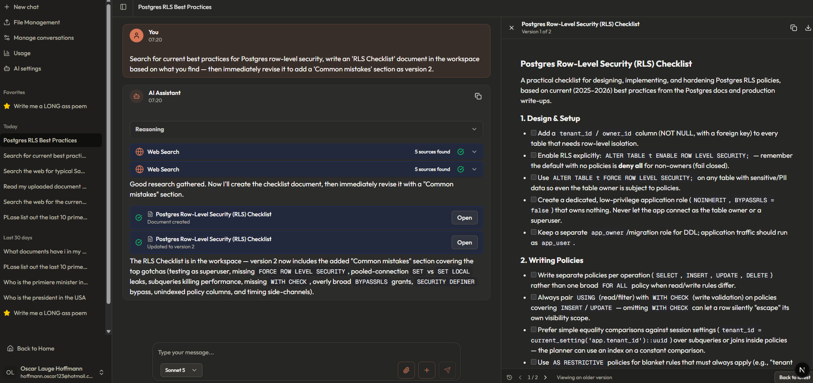

*One prompt → two web searches → a document written into the artifacts workspace, then revised to version 2. Every step cached, persisted and cost-tracked.*

https://github.com/user-attachments/assets/e9fa6007-6c68-4ce1-9c9c-7f00b902e859

*A real prompt running live — web search, charts, document search and more, in one turn.*

</div>

---

## Why this starter

Most chat templates stop at "streaming text in a box." This one is the full production stack — the same architecture that powers [Lovguiden.dk](https://www.lovguiden.dk/), a Danish legal-AI platform running RAG over millions of documents:

|  |  |  |
| --- | --- | --- |
| **🔐 Real auth, done right** — Supabase SSR with signup, signin, magic links, password reset, email templates and RLS on every table. No client-side key exposure. | **🧠 Eight AI tools** — document RAG, web search, artifacts, memory, conversation search, charts, PDFs. The AI decides when to use them; you get typed UI components for each. | **💰 Every token accounted for** — per-step usage stored on the message itself, rolled up into user and admin dashboards with cache-aware cost estimates. |
| **⚡ Prompt caching that actually works** — a two-tier Anthropic cache setup (static system + tools block, moving conversation breakpoint) serves multi-step tool turns at ~10% of normal input price. | **📄 Documents in, answers out** — upload a PDF and it's OCR'd (Mistral), embedded (Voyage), and searchable via hybrid vector + keyword RRF search. Fully autonomous — no file pickers. | **🗄️ One SQL file** — the entire schema (tables, RLS, triggers, storage policies, search functions, model seed) is a single idempotent `setup.sql`. Re-run it to upgrade. |

## Quickstart

```bash
git clone https://github.com/ElectricCodeGuy/SupabaseAuthWithSSR.git
cd SupabaseAuthWithSSR
npm install
cp .env.local.example .env.local   # fill in the keys below
npm run dev
```

1. **Database** — open the Supabase SQL Editor and run [`database/setup.sql`](database/setup.sql). That's the whole schema; it's safe to re-run.
2. **Storage** — create a private bucket named `userfiles` (Storage → Create Bucket). The RLS policies are already in `setup.sql`.
3. **Keys** — add to `.env.local`:

| Variable | Service | Used for |
| --- | --- | --- |
| `SUPABASE_URL` / `SUPABASE_ANON_KEY` / `SUPABASE_SERVICE_ROLE_KEY` | [Supabase](https://supabase.com) | Auth, database, storage |
| `ANTHROPIC_API_KEY` | [Anthropic](https://console.anthropic.com/dashboard) | Chat, chat titles, document metadata |
| `MISTRAL_API_KEY` | [Mistral](https://mistral.ai/) | PDF OCR (`mistral-ocr-latest`) |
| `VOYAGE_API_KEY` | [Voyage](https://www.voyageai.com/) | Document embeddings (`voyage-4-large`) |
| `EXA_API_KEY` | [Exa](https://exa.ai/) | Web search |

4. **Sign up** at `http://localhost:3000/signup` with a real email and click the confirmation link.
5. **(Optional) Make yourself admin** to unlock `/admin`:

```sql
UPDATE public.users SET is_admin = true WHERE email = 'you@example.com';
```

**Upgrading an existing install?** Just re-run [`database/setup.sql`](database/setup.sql) — it is idempotent (`IF NOT EXISTS` / `CREATE OR REPLACE` throughout), so it adds only what's new in v5: `user_memories`, `users.is_admin`, the `message_parts.usage` JSON column, `chat_sessions.settings`, the hybrid `match_documents` function, and the Anthropic model catalog (Sonnet 5, Opus 4.8, Fable 5 with official API pricing).

## The Tour

### 💬 Multi-step tool turns with live reasoning

One prompt can fan out into web searches, document lookups, chart rendering, PDF creation and artifact writing — all in a single assistant turn (the hero screenshot above shows exactly that). Each tool call renders as its own card with expandable reasoning, and every step is persisted incrementally, so the full trace survives a reload. Chats title themselves (a fast Haiku call after the first exchange), and the model you pick is stored on the conversation, so each chat keeps its own model.

### 🎨 Artifacts: a versioned document workspace

Ask for a document and it opens in a side panel next to the chat, streaming in live as the AI writes. Every create/update is automatically a version — with a version browser, copy, and Markdown download. There are **no extra tables** behind this: each version *is* the stored tool call. On desktop the panel pushes the chat aside; on mobile it's a slide-over.

### 📊 Charts + 📄 PDFs from real data

The AI renders bar, line, area and pie charts with a colorblind-safe palette, tooltips, legends and a data-table fallback. Below, it researched SaaS churn benchmarks on the web, checked the user's documents for internal numbers, charted the spread — then wrote the same analysis into a polished PDF report and saved it to the user's files:

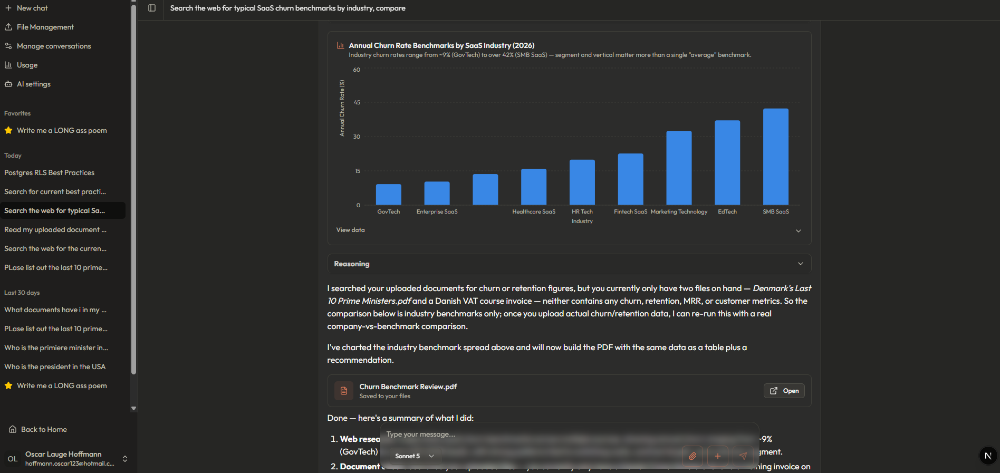

The `createPDF` tool renders style-templated documents (report/memo/letter/contract — cover page, table of contents, callouts, tables) with `@react-pdf/renderer`. The built-in file manager previews any PDF, and uploads are OCR'd, embedded and indexed for RAG automatically:

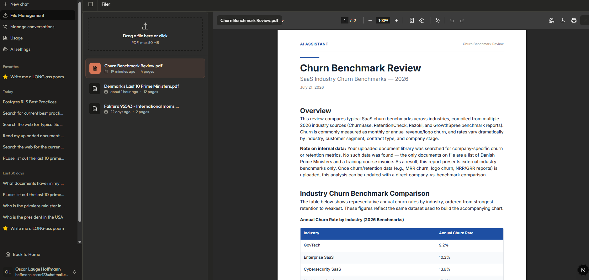

### 🧠 Memory & model control

<table>
<tr>
<td width="50%" valign="top">

**Long-term memory.** Tell the assistant to remember something and it persists across all chats — injected into every system prompt. View, add, edit and delete memories in the AI settings modal.

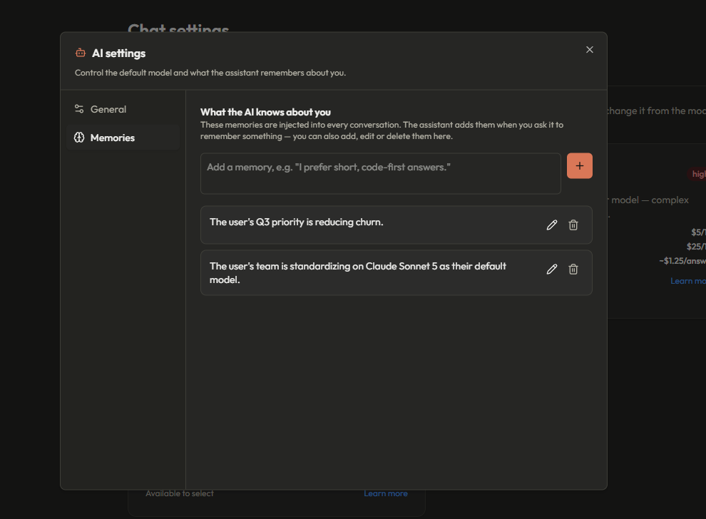

</td>
<td width="50%" valign="top">

**Database-driven model selection.** Models live in the `ai_models` table with pricing metadata — the picker shows a plain-language description and an approximate cost per answer. Ships with Sonnet 5 (default), Opus 4.8 and Fable 5.

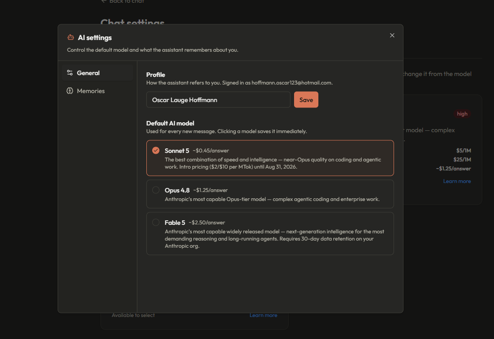

</td>
</tr>
</table>

### 💰 Usage dashboard — every token accounted for

Every generation step (each tool call is its own step) stores its token usage and cache metadata as JSON *on the message itself*. The `/usage` page turns that into range-filtered KPIs with period-over-period deltas, tokens per day, cache hit rate over time, and cost by model:

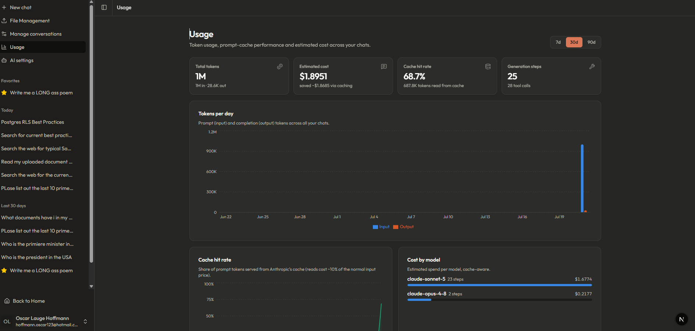

Because usage is attributed per step, spend breaks down by tool and by conversation — and any assistant message expands into its individual steps, each with its own model, tools, token counts and cache hit rate:

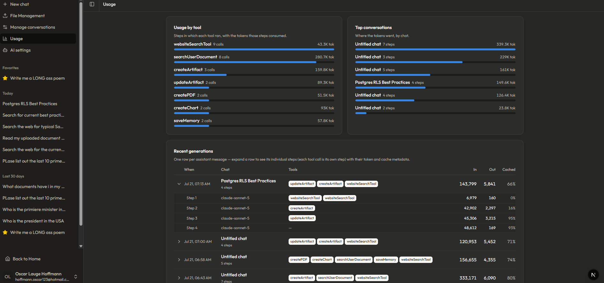

### 🛡️ Admin dashboard

Users with `is_admin = true` get the organization view: org-wide totals and daily volume, top users by cost, cost by model, and a user management table (rename, grant/revoke admin) with per-user usage. Every mutation re-verifies the caller is an admin server-side before touching the service-role client:

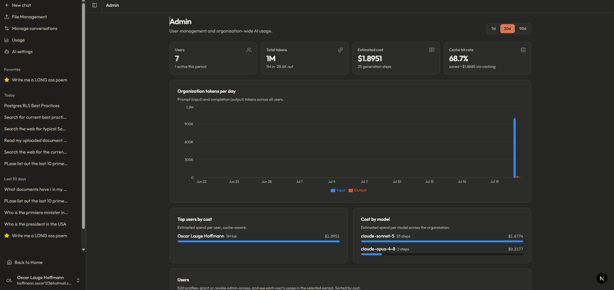

### 🗂️ Conversations, profile & the signed-out state

<table>
<tr>
<td width="50%" valign="top">

**Conversation management.** Search, rename, favorite, share or delete any conversation — favorites pin to the sidebar, history groups by day.

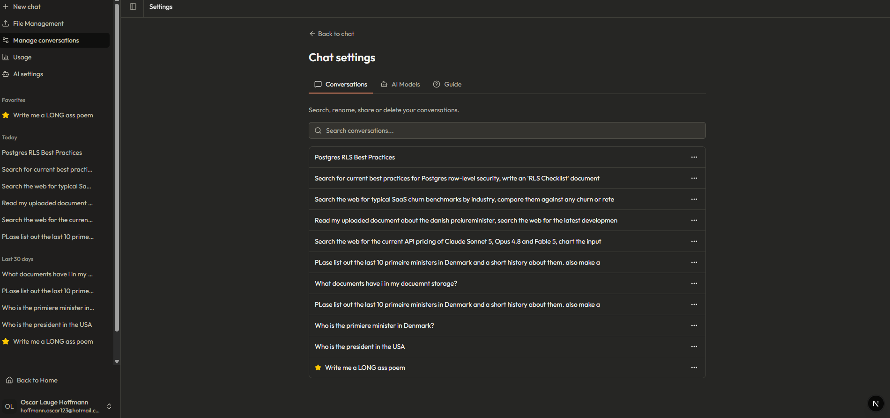

</td>
<td width="50%" valign="top">

**A profile page with real data.** Identity, role, default model, 30-day spend, memories and recent activity — one server round-trip.

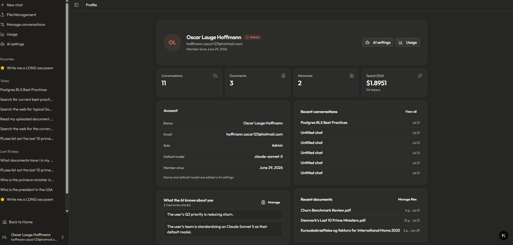

</td>
</tr>
</table>

Even signed-out visitors get a designed experience instead of a broken shell — locked nav items, a blurred preview of the chat rail behind a sign-in card, and honest CTAs:

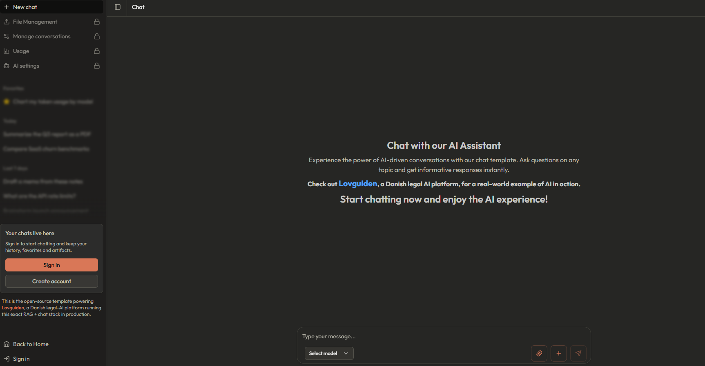

## The AI Tool Suite

Every tool follows the same pattern — a server-side definition in `app/api/chat/tools/`, registration in the chat route + `tooltypes.ts` (typed UI parts via `InferUITools`), and a dedicated React component that renders the call in the chat. Tool calls persist as `message_parts` rows, so the full trace (inputs, outputs, errors) survives a reload.

| Tool | What it does | Extra infra |
| --- | --- | --- |
| `searchUserDocument` | RAG over uploaded PDFs: list the newest documents, find one by name, read a page range or full content, or run a hybrid vector + keyword search (RRF fusion) | pgvector + Voyage embeddings |
| `websiteSearchTool` | Exa web search — the AI's query goes straight to Exa (no intermediate LLM round-trip), returning full text plus query-relevant highlights | Exa API key |
| `saveMemory` | Long-term memory: save / list / delete facts the user asks to remember; injected into every system prompt | `user_memories` table |
| `conversationSearch` | Keyword search across all the user's past chats, with snippets and links | none (reuses chat tables) |
| `createChart` | Interactive bar/line/area/pie charts rendered with Recharts from a Zod-validated spec | none |
| `createPDF` | One-shot polished PDFs — templates, cover page, TOC, callouts, tables, images — uploaded to Storage and previewable in the file manager | `@react-pdf/renderer` + bundled Inter fonts |
| `createArtifact` / `updateArtifact` | The document workspace: complete Markdown documents streamed live into a side panel, with version history | none (versions ARE the stored tool calls) |

**How the artifacts panel works:** the document content travels in the tool *input*, so the panel gets live typewriter streaming for free from the SDK's input-streaming states, and every create/update is automatically a persisted version. On desktop the panel is an in-flow flex sibling that pushes the chat aside (width animates 0 ↔ 45%); on mobile it's a slide-over. It auto-opens on new versions, remembers when you dismissed it, and lets you pin and browse older versions.

**How the caching works:** the system prompt is split into a *static* block (instructions + tool definitions) with an Anthropic `cacheControl` breakpoint, and a *dynamic* block (date, memories, artifact state) that stays out of the cache. Each generation step re-places a moving breakpoint on the last message, so in a 10-step tool turn, steps 2–10 read the whole conversation from cache at ~10% of the input price. The usage dashboard shows the hit rate so you can see it working.

## Usage Tracking & Dashboards

Every generation step stores a usage object on the first `message_parts` row saved for that step:

```json
{
  "model_id": "claude-opus-4-8",
  "input_tokens": 12340,
  "output_tokens": 220,
  "cache_read_tokens": 11800,
  "cache_write_tokens": 400,
  "tools": ["searchUserDocument"]
}
```

No separate usage table — the metadata lives with the message it belongs to, so cost is attributable per chat, per message, and per tool.

- **`/usage`** (every user): range-filtered KPIs with period-over-period deltas, tokens per day, cache hit rate over time, estimated cost + cache savings (computed against `ai_models` pricing with Anthropic's 0.1× cache-read / 1.25× cache-write multipliers), cost by model, usage by tool, top conversations, and a per-message generations table that expands into individual steps.
- **`/admin`** (users with `is_admin = true`): org-wide totals and daily chart, top users by cost, cost by model, plus a user table with per-user tokens, cache hit rate and estimated cost — and profile management. All mutations go through server actions that re-verify the caller is an admin before using the service-role client.

## Application Structure

Every route follows the same convention: `page.tsx` renders, `fetch.ts` holds all of that route's server fetching, and `components/` holds the components the page imports:

```
app/
├── (dashboard)/          # Authenticated routes
│   ├── fetch.ts          # Route-group fetching (sidebar user, AI settings data)
│   ├── chat/             # AI chat interface
│   │   ├── [id]/         # Individual chat sessions
│   │   ├── components/   # Chat UI (incl. ArtifactPanel + per-tool components)
│   │   └── settings/     # Conversations, AI models catalog, guide
│   ├── filer/            # File management + PDF viewer
│   ├── usage/            # Per-user token usage dashboard
│   ├── admin/            # Admin dashboard (user management + org usage)
│   ├── profile/          # Profile page
│   └── components/       # ONLY shared dashboard components:
│       ├── layout/       #   sidebar + header chrome
│       ├── analytics/    #   StatCard, BarList, RangeTabs, charts
│       └── ai-settings/  #   the hash-controlled AI settings modal
├── (frontpage)/          # Public routes (landing page, signin/signup)
└── api/
    └── chat/
        └── tools/        # documentChat · WebsiteSearchTool · MemoryTool
                          # ConversationSearchTool · ChartTool · CreatePDFTool
                          # ArtifactTool
```

## Database Setup

The entire schema — tables, indexes, RLS policies, the signup trigger, storage policies, and the `match_documents` search function — lives in a single idempotent file: [`database/setup.sql`](database/setup.sql). Run it in the Supabase SQL Editor and you're done; every statement uses `IF NOT EXISTS` / `CREATE OR REPLACE`, so it's safe to re-run.

> The schema covers users (with the `is_admin` flag), chat sessions (with `is_favorite` / `is_public` share flags and the `settings` JSON column that persists each conversation's model), incremental `message_parts` (with the per-step `usage` JSON column), long-term `user_memories`, document metadata, and the `pgvector` embeddings table with an HNSW index tuned for sub-second similarity search.

<details>
<summary><strong>📖 Deep dive: tuning the HNSW vector index</strong> — <code>m</code>/<code>ef_construction</code>, <code>halfvec</code>, the no-filtering rule, and hard-won production advice</summary>

<br>

Document embeddings are searched through an [HNSW](https://github.com/pgvector/pgvector#hnsw) index defined in `database/setup.sql`:

```sql
WITH (m = '16', ef_construction = '200')
```

- **`m = 16`** is the pgvector default and is the right choice in almost every case — leave it alone unless you have measured a recall problem. `m` controls how many connections each node keeps per layer, which is the main driver of index size. Raising it to `m = 32` roughly **doubles the index size** while giving little recall improvement on typical datasets.
- **`ef_construction = 200`** is the size of the candidate list used while _building_ the index. Higher values build a higher-quality graph (better recall) at the cost of slower index builds; it does not affect the final index size.
- **Keep the whole index in memory.** HNSW is only fast when the entire index fits in Postgres' buffer cache, which is roughly **25% of your instance's total RAM**. If the index grows larger than that, Postgres has to read parts of it from disk on each query and latency can degrade significantly. So as your document volume grows, watch the index size against your available RAM before reaching for a larger `m`.

#### Shrinking the index with `halfvec`

If the index gets too large to keep in memory anyway, switch the index to `halfvec` (16-bit half-precision floats). This **cuts the index size roughly in half** and, per pgvector's official benchmarks, only reduces recall by **about 1%**. You build the index over a cast of the existing `vector(1024)` column, so the stored data does not change:

```sql
DROP INDEX IF EXISTS public.user_documents_vec_embedding_idx;

CREATE INDEX user_documents_vec_embedding_idx
  ON public.user_documents_vec
  USING hnsw ((embedding::halfvec(1024)) halfvec_l2_ops)
  WITH (m = '16', ef_construction = '200');
```

> ⚠️ **Remember to update the query too.** The `match_documents` function in `database/setup.sql` must also cast to `halfvec` for the planner to use this index — i.e. order by `embedding::halfvec(1024) <=> query_embedding::halfvec(1024)`. If you switch the index to `halfvec`, update the function in the same migration.

#### HNSW indexes cannot be filtered

This is the big one. **An HNSW index is only used when the query has no `WHERE` filter on the table** — it just needs the vector distance `ORDER BY` and a `LIMIT` (exactly the shape `match_documents` already uses). The moment you add a `WHERE` condition on another column, Postgres can no longer use the index and falls back to a sequential scan.

If you need to filter, create a **separate partial HNSW index per filter value**. For example, if the table had a `category` column that can be `A`, `B`, or `C`:

```sql
-- One index per value the query will filter on
CREATE INDEX ... USING hnsw (embedding ...) WHERE category = 'A';
CREATE INDEX ... USING hnsw (embedding ...) WHERE category = 'B';
CREATE INDEX ... USING hnsw (embedding ...) WHERE category = 'C';
```

Postgres then picks the matching partial index when the query filters on that exact value. If you also need an **unfiltered global search**, you still need the plain index with no `WHERE` clause as well.

**When do you actually need all this?** Vector search works _without_ any index — it just does a sequential scan. That is perfectly fine for small tables, but it starts getting slow somewhere around **50k–100k rows**. So the practical rule:

- Keep **one global (unfiltered) index** — that is the one in `setup.sql`.
- Only add **per-filter partial indexes** for the specific filter values whose row counts climb past ~50k–100k. Below that, the sequential scan is good enough and not worth the extra index size.

The exact crossover point depends on your RAM and CPU. As a rough sizing guide: **do not run below 16 GB RAM and 4 CPU cores once you are above ~100k rows** — on smaller instances vector queries can spike to **3–5 second** response times.

#### Iterative scans and "relaxed" ordering (and why I avoid it)

pgvector has another answer to the filtering problem above: [**iterative index scans**](https://github.com/pgvector/pgvector#iterative-index-scans). The issue it tries to solve is that an HNSW scan returns its top-`k` candidates _first_ and the `WHERE` filter is applied _afterwards_ — so if your filter only matches a small fraction of rows, you can get back far fewer results than your `LIMIT` asked for. With iterative scans on, Postgres keeps re-scanning the index for more candidates until it has collected enough rows that satisfy the filter.

It comes in two modes (off by default — you opt in per session):

```sql
-- Slightly out of distance order, but better recall / more aggressive scanning
SET hnsw.iterative_scan = relaxed_order;

-- Guarantees exact distance order (less aggressive, can still fall short)
SET hnsw.iterative_scan = strict_order;
```

So **relaxed ordering** lets results come back _slightly out of order by distance_ in exchange for scanning harder to fill the filter. If you need them perfectly ordered again, you re-sort the relaxed results in an outer query:

```sql
WITH relaxed AS MATERIALIZED (
  SELECT id, embedding <=> '[...]' AS distance
  FROM user_documents_vec
  WHERE document_id = '...'
  ORDER BY distance
  LIMIT 10
)
SELECT * FROM relaxed ORDER BY distance + 0;
```

Two related knobs bound how hard it scans: `hnsw.max_scan_tuples` (default `20000`) and `hnsw.scan_mem_multiplier` (default `1`× `work_mem`).

> ⚠️ **My honest recommendation: don't rely on this mode.** On my main project ([lovguiden.dk](https://lovguiden.dk)), which has **1M–10M row** tables, relaxed (and iterative scans generally) produced **very slow and inefficient queries** — not the win the docs suggest at that scale. If you genuinely need filtered vector search on a large table, the **per-filter partial indexes** described above were far more predictable for me than leaning on iterative/relaxed ordering.

</details>

<details>
<summary><strong>🔄 Generating database types</strong> — regenerate <code>types/database.d.ts</code> after schema changes</summary>

<br>

The TypeScript types in `types/database.d.ts` are generated directly from your Supabase schema using the Supabase CLI (installed as a dev dependency). Whenever you change the schema, regenerate them with:

```bash
npm run types
```

This runs `supabase gen types typescript --project-id <project-id>` and writes the result to `types/database.d.ts`. It talks to the Supabase Management API, so you need to be authenticated once:

```bash
# Either log in interactively…
npx supabase login

# …or export a personal access token (from https://supabase.com/dashboard/account/tokens)
export SUPABASE_ACCESS_TOKEN=your_token_here
```

The project ID is configured in the `types` script in `package.json`; update it there if you point the app at a different Supabase project.

</details>

<details>
<summary><strong>📧 Email templates</strong> — required Supabase email template setup for the auth flow</summary>

<br>

For the auth flow to work with the API routes in this codebase, update your email templates in **Supabase → Authentication → Email Templates** to point at the `/api/auth/callback` route:

**Confirm Signup**

```html
<h2>Confirm your signup</h2>
<p>Follow this link to confirm your user:</p>
<a
  href="{{ .SiteURL }}/api/auth/callback?token_hash={{ .TokenHash }}&type=email"
  >Confirm your email</a
>
```

**Invite User**

```html
<h2>You have been invited</h2>
<p>
  You have been invited to create a user on {{ .SiteURL }}. Follow this link to
  accept the invite:
</p>
<a
  href="{{ .SiteURL }}/api/auth/callback?token_hash={{ .TokenHash }}&type=invite&next=/redirect/auth-password-update"
  >Accept the invite</a
>
```

**Magic Link**

```html
<h2>Magic Link</h2>
<p>Follow this link to login:</p>
<a
  href="{{ .SiteURL }}/api/auth/callback?token_hash={{ .TokenHash }}&type=email"
  >Log In</a
>
```

**Confirm Email Change**

```html
<h2>Confirm Change of Email</h2>
<p>
  Follow this link to confirm the update of your email from {{ .Email }} to {{
  .NewEmail }}:
</p>
<a href="{{ .ConfirmationURL }}">Change Email</a>
```

**Reset Password**

```html
<h2>Reset Password</h2>
<p>Follow this link to reset the password for your user:</p>
<a
  href="{{ .SiteURL }}/api/auth/callback?token_hash={{ .TokenHash }}&type=recovery&next=/redirect/auth-password-update"
  >Reset Password</a
>
```

</details>

## Code Structure and Philosophy

This project favors **code organization over design patterns**. Rather than forcing abstractions like the Factory Pattern, related code is kept together in the same feature folder so it is easy to understand and maintain at a glance.

Every route directory follows the same shape — `page.tsx` renders, `fetch.ts` holds all of that route's server fetching, and `components/` holds the components the page imports. Only truly shared code lives outside the routes: universal utilities (`getSession()` for auth, the database types, error-boundary components) and the dashboard-wide UI kit in `app/(dashboard)/components/` (layout chrome, analytics primitives, the AI settings modal). Everything else — custom hooks, API route handlers, feature-specific state and types — stays with its feature. The result is that each feature directory is a self-contained unit: changes can be made confidently without hunting through shared directories or worrying about side effects.

## Tech Stack

| Layer | Choice |
| --- | --- |
| Framework | Next.js 16 (App Router, Server Components, Server Actions) |
| Auth & Database | Supabase (SSR cookies, Postgres, RLS, Storage, pgvector) |
| AI | Vercel AI SDK v7 + Anthropic Claude (Sonnet 5 / Opus 4.8 / Fable 5, prompt caching, adaptive thinking) |
| RAG pipeline | Mistral OCR → Voyage `voyage-4-large` embeddings → hybrid pgvector + FTS search (RRF) |
| Web search | Exa (full text + highlights) |
| UI | Tailwind CSS v4, shadcn/ui, Recharts, `@react-pdf/renderer` |

---

<div align="center">

**If this starter saves you time, [give it a ⭐ on GitHub](https://github.com/ElectricCodeGuy/SupabaseAuthWithSSR) — it helps others find it.**

Licensed under the [MIT License](LICENSE.md).

</div>
