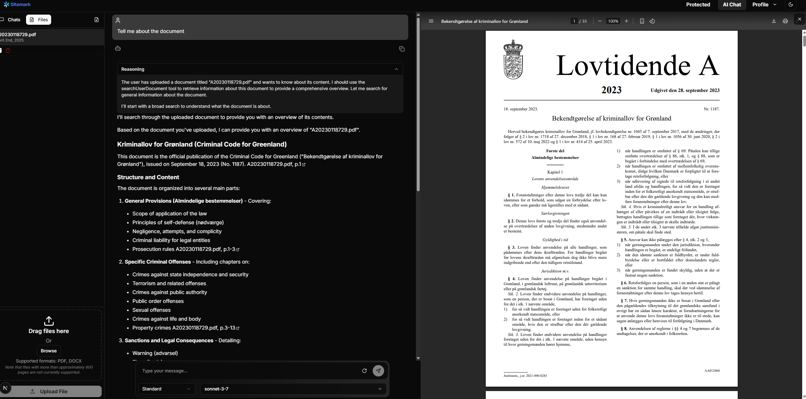
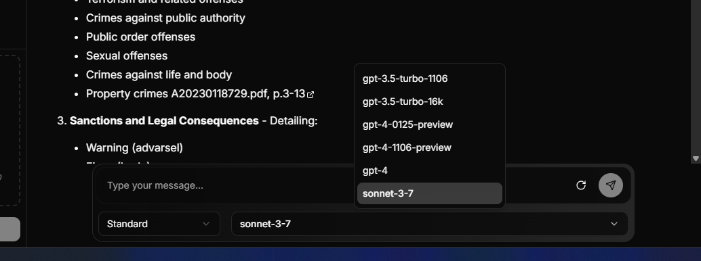
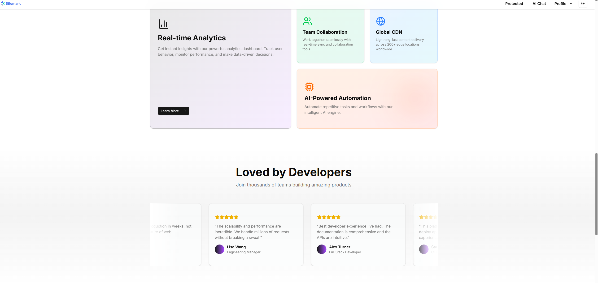
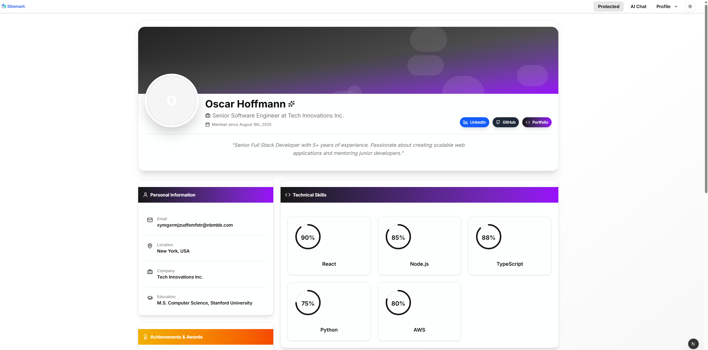
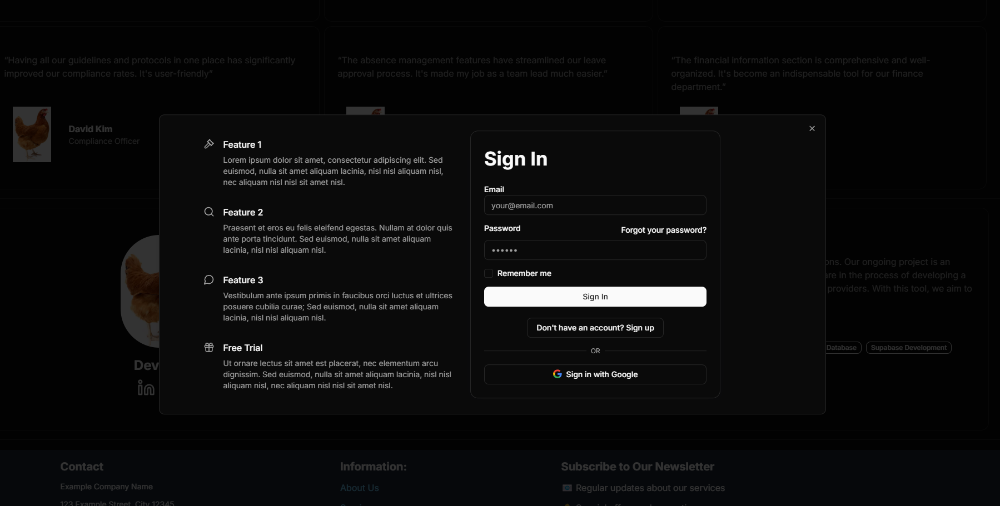
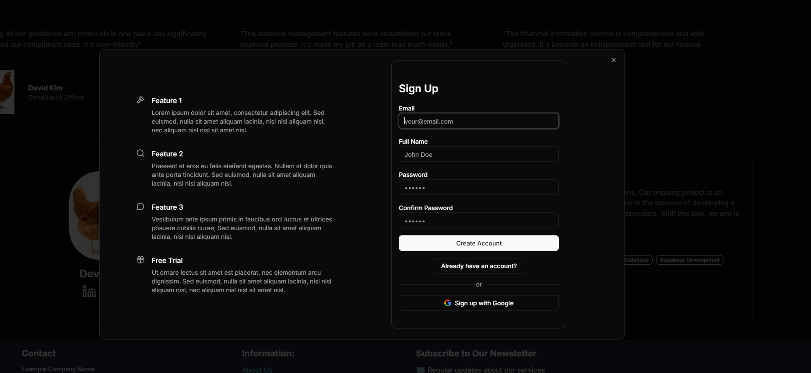
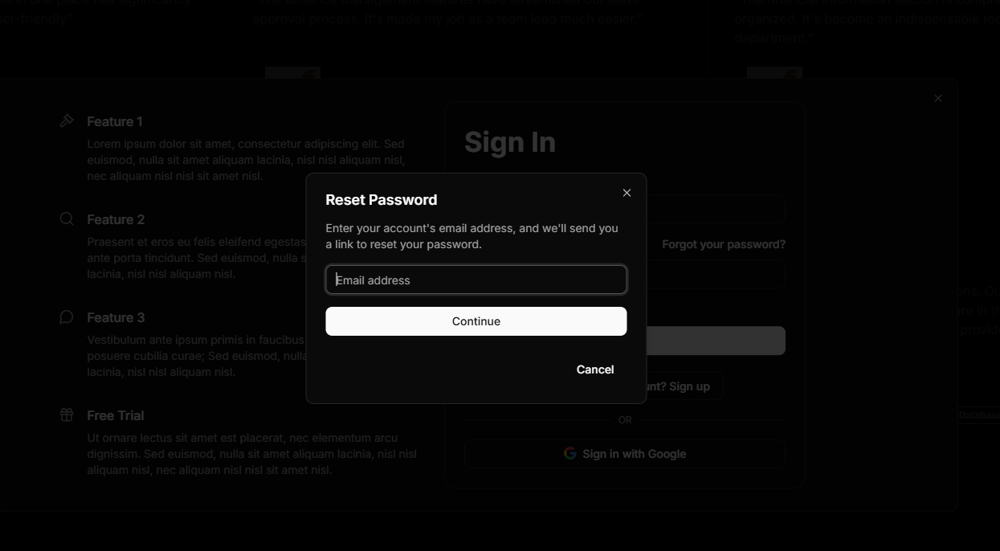

# Supabase Auth with SSR + RAG + AI Web Search + Autonomous Document Search

## Version 4.0.0

A complete authentication system built on **Supabase SSR**, featuring an AI chat
interface with autonomous document search and web search. The AI decides on its
own when to search your uploaded documents or the web based on the context of
your questions.

### Key Features

- **Autonomous Document Search** — the AI automatically searches your uploaded documents when relevant. No manual file selection needed.
- **Web Search** — real-time web search powered by Exa AI for up-to-date information.
- **Multi-Model Support** — switch between GPT-5, GPT-5 Mini, OpenAI O3, Claude 4.5 Sonnet, Gemini 2.5 Pro, and Gemini 2.5 Flash.
- **Incremental Message Saving** — messages are saved to the database part-by-part as the AI responds, preserving the exact order of tools, reasoning, and text.
- **Dashboard Route Groups** — clean separation between public pages and the authenticated dashboard (`/chat`, `/filer`).

## Showcase

<div style="display: flex; justify-content: center; align-items: center; flex-wrap: wrap;">
  
  
  
  
  
  
  
  
</div>

Demo videos are available in the `public/` folder.

## Table of Contents

- [Application Structure](#application-structure)
- [Getting Started](#getting-started)
  - [Prerequisites](#prerequisites)
  - [Installation](#installation)
  - [Database Setup](#database-setup)
  - [Storage Setup](#storage-setup)
  - [Environment Variables](#environment-variables)
- [Generating Database Types](#generating-database-types)
- [Email Templates](#email-templates)
- [Code Structure and Philosophy](#code-structure-and-philosophy)
- [License](#license)

## Application Structure

The app uses Next.js route groups for a clean separation between public and
authenticated areas:

```
app/
├── (dashboard)/          # Authenticated routes
│   ├── chat/             # AI chat interface
│   │   ├── [id]/         # Individual chat sessions
│   │   └── components/   # Chat UI components
│   └── filer/            # File management
├── (frontpage)/          # Public routes
│   └── components/       # Landing page components
└── api/
    └── chat/
        └── tools/        # AI tools (documentChat, websiteSearch)
```

## Getting Started

### Prerequisites

- A [Supabase account](https://supabase.io/)

**The AI features require the following API keys:**

- [Mistral AI](https://mistral.ai/) — OCR for uploaded PDFs (`mistral-ocr-latest`)
- [OpenAI](https://platform.openai.com/docs/overview)
- [Anthropic](https://console.anthropic.com/dashboard)
- [Voyage AI](https://www.voyageai.com/) — document embeddings (`voyage-4-large`, 1024 dimensions)
- [Exa AI](https://exa.ai/) — web search

### Installation

```bash
git clone https://github.com/ElectricCodeGuy/SupabaseAuthWithSSR.git
cd SupabaseAuthWithSSR
npm install
```

### Database Setup

The entire schema — tables, indexes, RLS policies, the trigger that creates a
`public.users` row on signup, the storage policies, and the `match_documents`
similarity-search function — lives in a single file:

```
database/setup.sql
```

**To set it up, open the Supabase SQL Editor and run [`database/setup.sql`](database/setup.sql).**

That's it — there is no longer any need to copy SQL out of this README. Everything
the application needs is in that one file, and it is safe to re-run (every
statement uses `IF NOT EXISTS` / `CREATE OR REPLACE`).

After running it:

1. Sign up at `http://localhost:3000/signup` with a real email address.
2. Open the verification email from Supabase and click the confirmation link to activate your account.

> The schema covers users, chat sessions (including the per-chat `is_favorite` and
> `is_public` share flags), incremental `message_parts`, document metadata, and the
> `pgvector` embeddings table with an HNSW index tuned for sub-second similarity
> search.

#### Tuning the HNSW vector index

Document embeddings are searched through an [HNSW](https://github.com/pgvector/pgvector#hnsw)
index defined in `database/setup.sql`:

```sql
WITH (m = '16', ef_construction = '200')
```

- **`m = 16`** is the pgvector default and is the right choice in almost every
  case — leave it alone unless you have measured a recall problem. `m` controls
  how many connections each node keeps per layer, which is the main driver of
  index size. Raising it to `m = 32` roughly **doubles the index size** while
  giving little recall improvement on typical datasets.
- **`ef_construction = 200`** is the size of the candidate list used while
  _building_ the index. Higher values build a higher-quality graph (better
  recall) at the cost of slower index builds; it does not affect the final index
  size.
- **Keep the whole index in memory.** HNSW is only fast when the entire index
  fits in Postgres' buffer cache, which is roughly **25% of your instance's
  total RAM**. If the index grows larger than that, Postgres has to read parts of
  it from disk on each query and latency can degrade significantly. So as your
  document volume grows, watch the index size against your available RAM before
  reaching for a larger `m`.

##### Shrinking the index with `halfvec`

If the index gets too large to keep in memory anyway — roughly, switch the index to `halfvec` (16-bit half-precision floats).
This **cuts the index size roughly in half** and, per pgvector's official
benchmarks, only reduces recall by **about 1%**. You build the index over a cast
of the existing `vector(1024)` column, so the stored data does not change:

```sql
DROP INDEX IF EXISTS public.user_documents_vec_embedding_idx;

CREATE INDEX user_documents_vec_embedding_idx
  ON public.user_documents_vec
  USING hnsw ((embedding::halfvec(1024)) halfvec_l2_ops)
  WITH (m = '16', ef_construction = '200');
```

> ⚠️ **Remember to update the query too.** The `match_documents` function in
> `database/setup.sql` must also cast to `halfvec` for the planner to use this
> index — i.e. order by `embedding::halfvec(1024) <=> query_embedding::halfvec(1024)`.
> If you switch the index to `halfvec`, update the function in the same migration.

##### HNSW indexes cannot be filtered

This is the big one. **An HNSW index is only used when the query has no `WHERE`
filter on the table** — it just needs the vector distance `ORDER BY` and a `LIMIT`
(exactly the shape `match_documents` already uses). The moment you add a `WHERE`
condition on another column, Postgres can no longer use the index and falls back
to a sequential scan.

If you need to filter, create a **separate partial HNSW index per filter value**.
For example, if the table had a `category` column that can be `A`, `B`, or `C`:

```sql
-- One index per value the query will filter on
CREATE INDEX ... USING hnsw (embedding ...) WHERE category = 'A';
CREATE INDEX ... USING hnsw (embedding ...) WHERE category = 'B';
CREATE INDEX ... USING hnsw (embedding ...) WHERE category = 'C';
```

Postgres then picks the matching partial index when the query filters on that
exact value. If you also need an **unfiltered global search**, you still need the
plain index with no `WHERE` clause as well.

**When do you actually need all this?** Vector search works _without_ any index —
it just does a sequential scan. That is perfectly fine for small tables, but it
starts getting slow somewhere around **50k–100k rows**. So the practical rule:

- Keep **one global (unfiltered) index** — that is the one in `setup.sql`.
- Only add **per-filter partial indexes** for the specific filter values whose row
  counts climb past ~50k–100k. Below that, the sequential scan is good enough and
  not worth the extra index size.

The exact crossover point depends on your RAM and CPU. As a rough sizing guide:
**do not run below 16 GB RAM and 4 CPU cores once you are above ~100k rows** — on
smaller instances vector queries can spike to **3–5 second** response times.

##### Iterative scans and "relaxed" ordering (and why I avoid it)

pgvector has another answer to the filtering problem above:
[**iterative index scans**](https://github.com/pgvector/pgvector#iterative-index-scans).
The issue it tries to solve is that an HNSW scan returns its top-`k` candidates
_first_ and the `WHERE` filter is applied _afterwards_ — so if your filter only
matches a small fraction of rows, you can get back far fewer results than your
`LIMIT` asked for. With iterative scans on, Postgres keeps re-scanning the index
for more candidates until it has collected enough rows that satisfy the filter.

It comes in two modes (off by default — you opt in per session):

```sql
-- Slightly out of distance order, but better recall / more aggressive scanning
SET hnsw.iterative_scan = relaxed_order;

-- Guarantees exact distance order (less aggressive, can still fall short)
SET hnsw.iterative_scan = strict_order;
```

So **relaxed ordering** lets results come back _slightly out of order by distance_
in exchange for scanning harder to fill the filter. If you need them perfectly
ordered again, you re-sort the relaxed results in an outer query:

```sql
WITH relaxed AS MATERIALIZED (
  SELECT id, embedding <=> '[...]' AS distance
  FROM user_documents_vec
  WHERE document_id = '...'
  ORDER BY distance
  LIMIT 10
)
SELECT * FROM relaxed ORDER BY distance + 0;
```

Two related knobs bound how hard it scans: `hnsw.max_scan_tuples` (default
`20000`) and `hnsw.scan_mem_multiplier` (default `1`× `work_mem`).

> ⚠️ **My honest recommendation: don't rely on this mode.** On my main project
> ([lovguiden.dk](https://lovguiden.dk)), which has **1M–10M row** table, relaxed
> (and iterative scans generally) produced **very slow and inefficient queries** —
> not the win the docs suggest at that scale. If you genuinely need filtered vector
> search on a large table, the **per-filter partial indexes** described above were
> far more predictable for me than leaning on iterative/relaxed ordering.

### Storage Setup

Document upload requires a storage bucket:

1. Go to **Storage** in your Supabase dashboard and click **Create Bucket**.
2. Name it `userfiles` and set it to **private**.

The row-level security policies that scope each user to their own folder are
already included in `database/setup.sql` (Step 9), so no extra SQL is needed.

### Environment Variables

Copy `.env.local.example` to `.env.local` and fill in your values:

```bash
cp .env.local.example .env.local
```

**Supabase**

- `SUPABASE_URL` — your Supabase project URL
- `SUPABASE_ANON_KEY` — your anon (public) key
- `SUPABASE_SERVICE_ROLE_KEY` — your service-role key

**Document Processing**

- `MISTRAL_API_KEY` — Mistral AI key (OCR for uploaded PDFs via `mistral-ocr-latest`)

**AI Models**

- `OPENAI_API_KEY`
- `ANTHROPIC_API_KEY`
- `GOOGLE_GENERATIVE_AI_API_KEY`

**Embeddings & Search**

- `VOYAGE_API_KEY` — document embeddings
- `EXA_API_KEY` — web search

## Generating Database Types

The TypeScript types in `types/database.d.ts` are generated directly from your
Supabase schema using the Supabase CLI (installed as a dev dependency). Whenever
you change the schema, regenerate them with:

```bash
npm run types
```

This runs `supabase gen types typescript --project-id <project-id>` and writes the
result to `types/database.d.ts`. It talks to the Supabase Management API, so you
need to be authenticated once:

```bash
# Either log in interactively…
npx supabase login

# …or export a personal access token (from https://supabase.com/dashboard/account/tokens)
export SUPABASE_ACCESS_TOKEN=your_token_here
```

The project ID is configured in the `types` script in `package.json`; update it
there if you point the app at a different Supabase project.

## Email Templates

For the auth flow to work with the API routes in this codebase, update your email
templates in **Supabase → Authentication → Email Templates** to point at the
`/api/auth/callback` route:

**Confirm Signup**

```html
<h2>Confirm your signup</h2>
<p>Follow this link to confirm your user:</p>
<a
  href="{{ .SiteURL }}/api/auth/callback?token_hash={{ .TokenHash }}&type=email"
  >Confirm your email</a
>
```

**Invite User**

```html
<h2>You have been invited</h2>
<p>
  You have been invited to create a user on {{ .SiteURL }}. Follow this link to
  accept the invite:
</p>
<a
  href="{{ .SiteURL }}/api/auth/callback?token_hash={{ .TokenHash }}&type=invite&next=/auth-password-update"
  >Accept the invite</a
>
```

**Magic Link**

```html
<h2>Magic Link</h2>
<p>Follow this link to login:</p>
<a
  href="{{ .SiteURL }}/api/auth/callback?token_hash={{ .TokenHash }}&type=email"
  >Log In</a
>
```

**Confirm Email Change**

```html
<h2>Confirm Change of Email</h2>
<p>
  Follow this link to confirm the update of your email from {{ .Email }} to {{
  .NewEmail }}:
</p>
<a href="{{ .ConfirmationURL }}">Change Email</a>
```

**Reset Password**

```html
<h2>Reset Password</h2>
<p>Follow this link to reset the password for your user:</p>
<a
  href="{{ .SiteURL }}/api/auth/callback?token_hash={{ .TokenHash }}&type=recovery&next=/auth-password-update"
  >Reset Password</a
>
```

## Code Structure and Philosophy

This project favors **code organization over design patterns**. Rather than
forcing abstractions like the Factory Pattern, related code is kept together in
the same feature folder so it is easy to understand and maintain at a glance.

Only truly universal utilities are shared (`getSession()` for auth, the database
type definitions, error-boundary components). Everything else — custom hooks, API
route handlers, feature-specific state and types — stays with its feature. The
result is that each feature directory is a self-contained unit: changes can be
made confidently without hunting through shared directories or worrying about side
effects.

## License

Licensed under the MIT License. See [LICENSE.md](LICENSE.md) for details.
